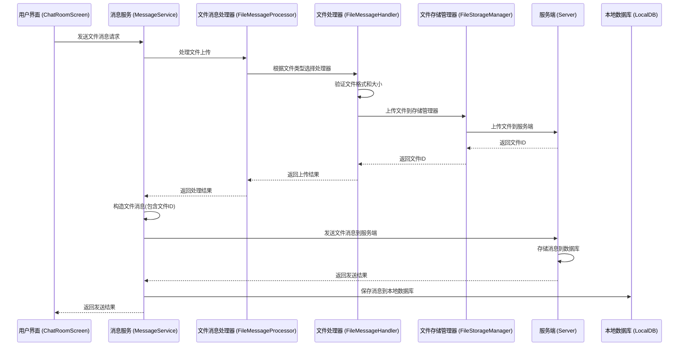
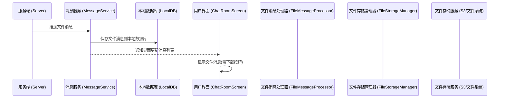
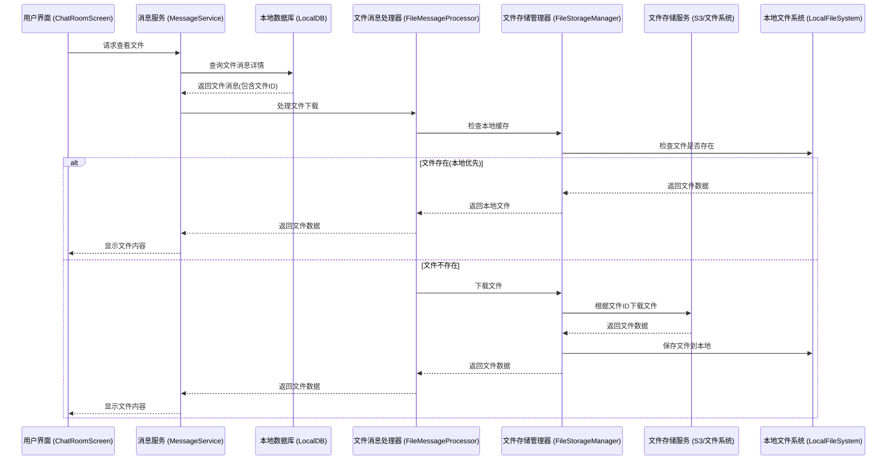
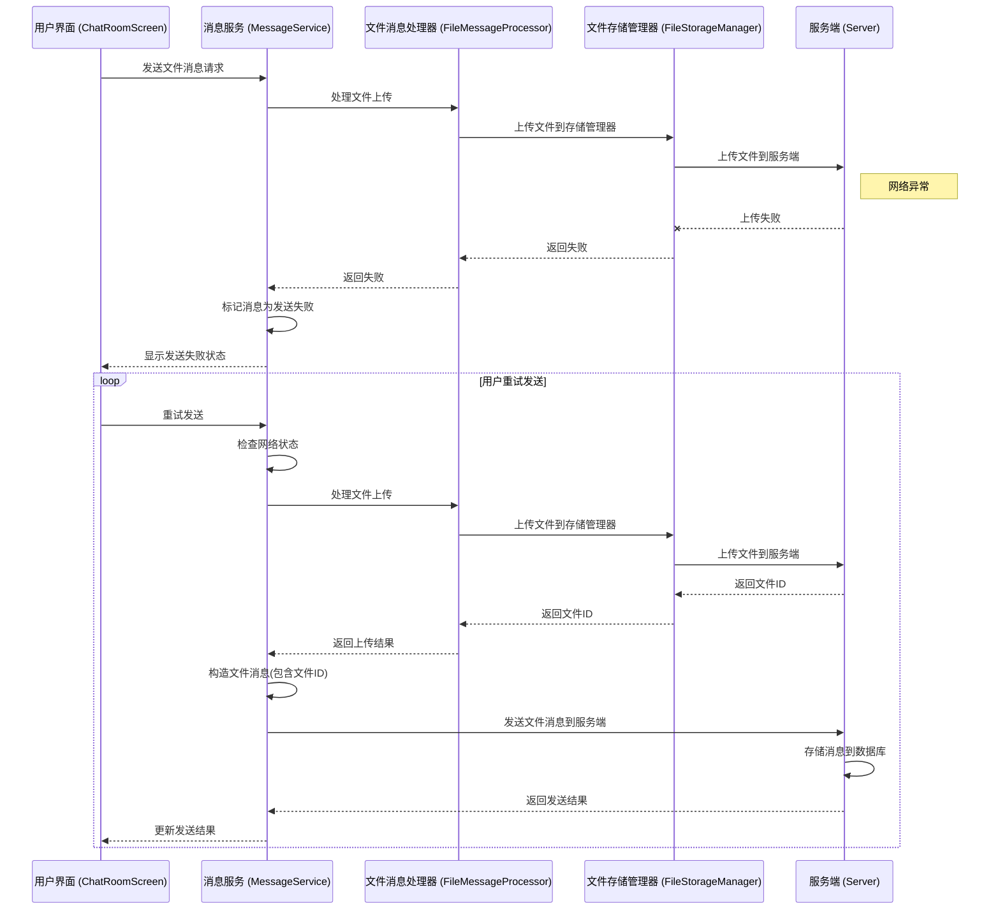
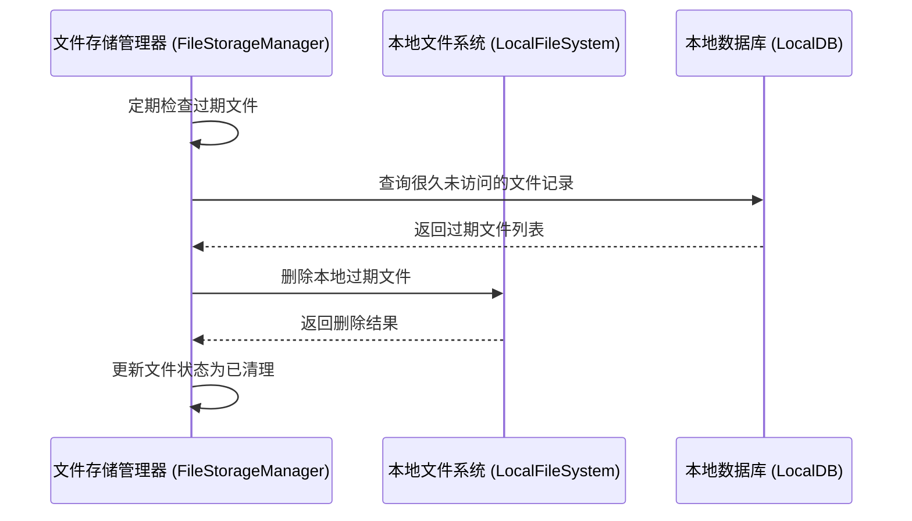

# IM系统文件消息处理时序图

## 1. 文件发送流程

```mermaid
sequenceDiagram
    participant U as 用户界面 (ChatRoomScreen)
    participant M as 消息服务 (MessageService)
    participant FMP as 文件消息处理器 (FileMessageProcessor)
    participant FMH as 文件处理器 (FileMessageHandler)
    participant FSM as 文件存储管理器 (FileStorageManager)
    participant S as 服务端 (Server)
    participant DB as 本地数据库 (LocalDB)

    U->>M: 发送文件消息请求
    M->>FMP: 处理文件上传
    FMP->>FMH: 根据文件类型选择处理器
    FMH->>FMH: 验证文件格式和大小
    FMH->>FSM: 上传文件到存储管理器
    FSM->>S: 上传文件到服务端
    S-->>FSM: 返回文件ID
    FSM-->>FMH: 返回文件ID
    FMH-->>FMP: 返回上传结果
    FMP-->>M: 返回处理结果
    M->>M: 构造文件消息(包含文件ID)
    M->>S: 发送文件消息到服务端
    S->>S: 存储消息到数据库
    S-->>M: 返回发送结果
    M->>DB: 保存消息到本地数据库
    M-->>U: 返回发送结果
```

## 2. 文件接收流程

```mermaid
sequenceDiagram
    participant S as 服务端 (Server)
    participant M as 消息服务 (MessageService)
    participant DB as 本地数据库 (LocalDB)
    participant U as 用户界面 (ChatRoomScreen)
    participant FMP as 文件消息处理器 (FileMessageProcessor)
    participant FSM as 文件存储管理器 (FileStorageManager)
    participant S3 as 文件存储服务 (S3/文件系统)

    S->>M: 推送文件消息
    M->>DB: 保存文件消息到本地数据库
    M-->>U: 通知界面更新消息列表
    U->>U: 显示文件消息(带下载按钮)
```

## 3. 文件下载和查看流程

```mermaid
sequenceDiagram
    participant U as 用户界面 (ChatRoomScreen)
    participant M as 消息服务 (MessageService)
    participant DB as 本地数据库 (LocalDB)
    participant FMP as 文件消息处理器 (FileMessageProcessor)
    participant FSM as 文件存储管理器 (FileStorageManager)
    participant S3 as 文件存储服务 (S3/文件系统)
    participant LF as 本地文件系统 (LocalFileSystem)

    U->>M: 请求查看文件
    M->>DB: 查询文件消息详情
    DB-->>M: 返回文件消息(包含文件ID)
    M->>FMP: 处理文件下载
    FMP->>FSM: 检查本地缓存
    FSM->>LF: 检查文件是否存在
    alt 文件存在(本地优先)
        LF-->>FSM: 返回文件数据
        FSM-->>FMP: 返回本地文件
        FMP-->>M: 返回文件数据
        M-->>U: 显示文件内容
    else 文件不存在
        FMP->>FSM: 下载文件
        FSM->>S3: 根据文件ID下载文件
        S3-->>FSM: 返回文件数据
        FSM->>LF: 保存文件到本地
        FSM-->>FMP: 返回文件数据
        FMP-->>M: 返回文件数据
        M-->>U: 显示文件内容
    end
```

## 4. 文件上传重试机制

```mermaid
sequenceDiagram
    participant U as 用户界面 (ChatRoomScreen)
    participant M as 消息服务 (MessageService)
    participant FMP as 文件消息处理器 (FileMessageProcessor)
    participant FSM as 文件存储管理器 (FileStorageManager)
    participant S as 服务端 (Server)

    U->>M: 发送文件消息请求
    M->>FMP: 处理文件上传
    FMP->>FSM: 上传文件到存储管理器
    FSM->>S: 上传文件到服务端
    Note right of S: 网络异常
    S--XFSM: 上传失败
    FSM-->>FMP: 返回失败
    FMP-->>M: 返回失败
    M->>M: 标记消息为发送失败
    M-->>U: 显示发送失败状态
    loop 用户重试发送
        U->>M: 重试发送
        M->>M: 检查网络状态
        M->>FMP: 处理文件上传
        FMP->>FSM: 上传文件到存储管理器
        FSM->>S: 上传文件到服务端
        S-->>FSM: 返回文件ID
        FSM-->>FMP: 返回文件ID
        FMP-->>M: 返回上传结果
        M->>M: 构造文件消息(包含文件ID)
        M->>S: 发送文件消息到服务端
        S->>S: 存储消息到数据库
        S-->>M: 返回发送结果
        M-->>U: 更新发送结果
    end
```

## 5. 文件清理机制

```mermaid
sequenceDiagram
    participant FSM as 文件存储管理器 (FileStorageManager)
    participant LF as 本地文件系统 (LocalFileSystem)
    participant DB as 本地数据库 (LocalDB)

    FSM->>FSM: 定期检查过期文件
    FSM->>DB: 查询很久未访问的文件记录
    DB-->>FSM: 返回过期文件列表
    FSM->>LF: 删除本地过期文件
    LF-->>FSM: 返回删除结果
    FSM->>FSM: 更新文件状态为已清理
```