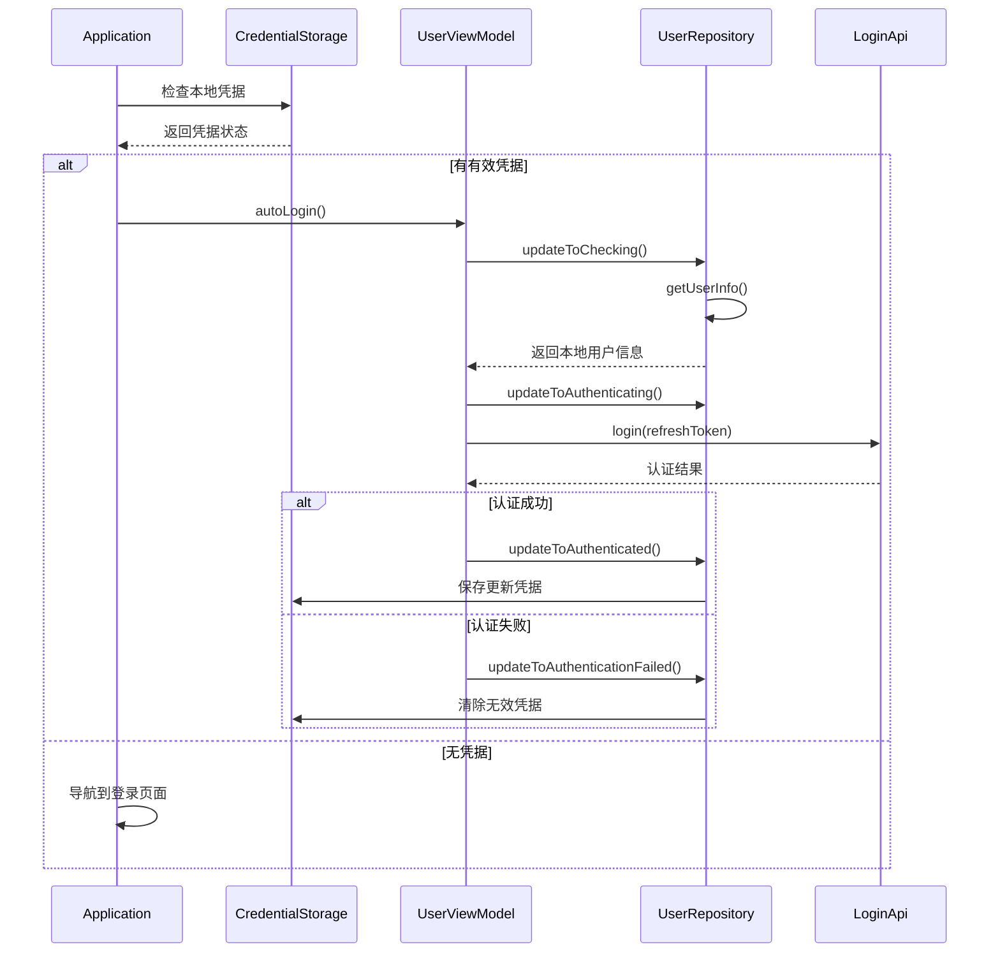

# 登录流程详细文档

## 1. 概述

本文档详细描述 Group IM 应用的用户登录完整流程，包括从用户界面交互到后端认证的全过程技术实现。

## 2. 登录流程总览

### 2.1 整体架构图
```
用户界面 → ViewModel → Repository → API层 → 后端服务
   ↓         ↓          ↓         ↓         ↓
UI交互    状态管理    业务逻辑    网络请求    认证服务
```

### 2.2 登录方式支持
- **账号密码登录**：传统用户名/邮箱 + 密码方式
- **Token刷新登录**：使用存储的refreshToken自动登录
- **扫码登录**：二维码扫描快速登录（预留）

## 3. 详细流程说明

### 3.1 应用启动登录检查流程

#### 3.1.1 启动时序图


#### 3.1.2 状态转换逻辑
```kotlin
sealed class LoginState {
    object Idle : LoginState()           // 初始状态
    object Checking : LoginState()       // 检查本地凭据
    object Authenticating : LoginState() // 正在认证
    data class Authenticated(val userInfo: UserInfo) : LoginState() // 认证成功
    data class AuthenticationFailed(val error: String, val isNetworkError: Boolean) : LoginState() // 认证失败
    object LoggingOut : LoginState()     // 正在登出
}
```

### 3.2 手动登录流程

#### 3.2.1 用户交互流程
1. 用户在登录页面输入账号和密码
2. 点击登录按钮触发表单验证
3. ViewModel发起登录请求
4. Repository更新状态并调用API
5. 根据结果更新UI状态

#### 3.2.2 核心代码实现
```kotlin
// UserViewModel.kt
fun login(username: String, password: String) {
    viewModelScope.launch {
        try {
            // 更新状态为认证中
            userRepository.updateToAuthenticating()
            
            // 调用登录API
            val response = LoginApi.login(username, password, "")
            
            // 登录成功处理
            handleLoginSuccess(response)
        } catch (e: Exception) {
            // 登录失败处理
            handleLoginFailure(e)
        }
    }
}

private fun handleLoginSuccess(userInfo: UserInfo) {
    // 保存用户凭据
    GlobalCredentialProvider.storage.saveUserInfo(userInfo)
    
    // 更新全局状态
    GlobalCredentialProvider.currentToken = userInfo.token
    
    // 通知各模块用户已登录
    loginStateManager.setLoggedIn(userInfo)
    
    // 更新Repository状态
    userRepository.updateToAuthenticated(userInfo)
}
```

### 3.3 自动登录流程

#### 3.3.1 触发条件
- 应用启动时检测到本地存储的refreshToken
- 网络恢复后重试之前的登录请求
- Token过期后的静默刷新

#### 3.3.2 实现逻辑
```kotlin
// UserViewModel.kt
fun autoLogin() {
    viewModelScope.launch {
        try {
            // 检查本地凭据
            val localUserInfo = GlobalCredentialProvider.storage.getUserInfo()
            if (localUserInfo == null) {
                userRepository.updateToLoggedOut()
                return@launch
            }
            
            // 更新状态为检查中
            userRepository.updateToChecking()
            
            // 更新状态为认证中
            userRepository.updateToAuthenticating()
            
            // 使用refreshToken进行认证
            val response = LoginApi.login("", "", localUserInfo.refreshToken)
            
            // 处理认证结果
            handleLoginSuccess(response)
        } catch (e: Exception) {
            handleLoginFailure(e)
        }
    }
}
```

### 3.4 登出流程

#### 3.4.1 完整登出步骤
1. 更新状态为登出中
2. 通知各业务模块清理状态
3. 清除本地存储的用户凭据
4. 断开网络连接
5. 更新状态为已登出

#### 3.4.2 代码实现
```kotlin
// UserViewModel.kt
fun logout() {
    userRepository.updateToLoggingOut()
    loginStateManager.setLoggingOut()
    
    try {
        // 清除用户信息
        viewModelScope.launch {
            GlobalCredentialProvider.storage.clearUserInfo()
            GlobalCredentialProvider.currentToken = ""
        }
        
        // 通知登录状态管理器用户已登出
        loginStateManager.setLoggedOut()
        
        // 更新用户仓库中的状态为登出
        userRepository.updateToLoggedOut()
    } catch (e: Exception) {
        Napier.d { "登出错误 ： ${e.message}" }
    }
}
```

## 4. 数据存储与安全管理

### 4.1 凭据存储结构
```kotlin
// UserInfo.kt
@Serializable
data class UserInfo(
    val userId: Long,
    val username: String,
    val email: String,
    val token: String = "",
    val refreshToken: String = "",
    val companyId: Long? = null,
    val phoneNumber: String? = null,
    val currentLoginCompanyId: Long? = null
)
```

### 4.2 存储安全策略
- **Token加密存储**：使用平台特定的安全存储机制
- **定期刷新**：实现Token自动刷新机制
- **过期处理**：检测并处理Token过期情况
- **安全清除**：登出时彻底清除敏感信息

### 4.3 全局凭据管理
```kotlin
// GlobalCredentialProvider.kt
object GlobalCredentialProvider {
    var currentToken: String = ""
        set(value) {
            field = value
            // 更新全局HTTP客户端的认证头
            updateHttpClientAuth()
        }
    
    val storage: CredentialStorage by lazy {
        // 根据平台初始化对应的存储实现
        PlatformCredentialStorage()
    }
    
    private fun updateHttpClientAuth() {
        // 更新所有HTTP客户端的Authorization头
        ProxyConfig.defaultHeaders["Authorization"] = "Bearer $currentToken"
    }
}
```

## 5. 错误处理与重试机制

### 5.1 错误分类
```kotlin
sealed class LoginError {
    data class NetworkError(val message: String) : LoginError()
    data class AuthenticationError(val message: String) : LoginError()
    data class ValidationError(val field: String, val message: String) : LoginError()
    object UnknownError : LoginError()
}
```

### 5.2 重试策略
- **网络错误**：指数退避重试（最大3次）
- **认证失败**：引导用户重新输入凭据
- **Token过期**：自动刷新或重新登录

### 5.3 用户体验优化
- 提供清晰的错误提示信息
- 网络异常时显示重试选项
- 登录过程中显示加载状态

## 6. 跨平台适配

### 6.1 Android平台实现
```kotlin
// androidMain/kotlin/PlatformCredentialStorage.kt
actual class PlatformCredentialStorage : CredentialStorage {
    private val sharedPreferences = applicationContext.getSharedPreferences("user_credentials", Context.MODE_PRIVATE)
    
    actual override fun saveUserInfo(userInfo: UserInfo) {
        val editor = sharedPreferences.edit()
        editor.putString("user_info", Json.encodeToString(userInfo))
        editor.apply()
    }
    
    actual override fun getUserInfo(): UserInfo? {
        val json = sharedPreferences.getString("user_info", null)
        return json?.let { Json.decodeFromString<UserInfo>(it) }
    }
}
```

### 6.2 Web平台实现
```kotlin
// jsMain/kotlin/PlatformCredentialStorage.kt
actual class PlatformCredentialStorage : CredentialStorage {
    actual override fun saveUserInfo(userInfo: UserInfo) {
        localStorage.setItem("user_info", JSON.stringify(userInfo))
    }
    
    actual override fun getUserInfo(): UserInfo? {
        val json = localStorage.getItem("user_info")
        return json?.let { JSON.parse<UserInfo>(it) }
    }
}
```

## 7. 性能优化

### 7.1 启动优化
- 异步加载用户信息
- 预加载常用数据
- 延迟初始化非核心功能

### 7.2 网络优化
- 连接池复用
- 请求合并
- 缓存策略

### 7.3 内存优化
- 及时释放不需要的对象
- 使用弱引用避免内存泄漏
- 合理控制缓存大小

## 8. 监控与日志

### 8.1 关键指标监控
- 登录成功率
- 登录耗时
- 错误类型分布
- 重试次数统计

### 8.2 日志记录策略
```kotlin
// 登录开始
Napier.d("开始登录流程 - 用户名: $username")

// 登录成功
Napier.i("登录成功 - 用户ID: ${userInfo.userId}")

// 登录失败
Napier.e("登录失败 - 错误: ${e.message}", e)
```

## 9. 安全考虑

### 9.1 数据传输安全
- 使用HTTPS加密传输
- 敏感信息不记录日志
- 防止中间人攻击

### 9.2 本地存储安全
- 加密存储敏感信息
- 定期清理过期数据
- 防止越权访问

### 9.3 认证安全
- 密码强度验证
- 防暴力破解机制
- 多因素认证支持（预留）

## 10. 未来扩展

### 10.1 功能扩展
- 生物识别登录（指纹、面部识别）
- 第三方登录（微信、QQ、Google等）
- 单点登录（SSO）支持

### 10.2 技术优化
- 更智能的离线登录支持
- 基于AI的异常登录检测
- 分布式认证架构

---
*文档版本：v1.0*
*最后更新：2026-02-09*