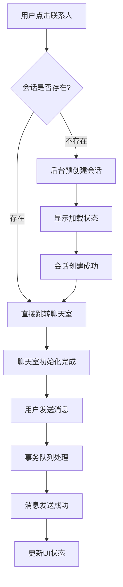

# 聊天室会话管理优化实施计划

## 项目概述
优化当前聊天室会话创建和消息发送流程，解决会话创建时机不当、原子性缺失和数据一致性问题。

## 当前问题总结
1. **会话创建延迟**：在发送消息时才创建会话，而非进入聊天室时
2. **缺乏原子性**：会话创建、消息发送、文件上传等操作分离处理
3. **数据一致性风险**：网络异常时容易出现数据不一致
4. **用户体验不佳**：聊天室初始化时没有有效会话上下文

## 目标架构

### 核心设计原则
- **预创建优先**：在用户意图明确时提前创建必要资源
- **事务性保证**：关键操作具备ACID特性
- **状态可追溯**：每步操作都有明确状态和回滚机制
- **用户体验优先**：最小化用户感知的延迟和错误

### 新架构流程图


## 详细实施步骤

### Phase 1: 基础架构重构 (预计2周)

#### Week 1: 会话预创建机制
**目标**：实现导航前的会话预创建

**Tasks:**
- [ ] 设计会话预创建API接口
- [ ] 修改ContactsUI导航逻辑
- [ ] 实现会话缓存机制
- [ ] 添加加载状态管理

**关键技术点:**
```kotlin
// 新的导航函数
suspend fun navigateToChat(userId: Long): Result<Long> {
    // 1. 检查缓存中是否已有会话
    val cachedSession = sessionCache.get(userId)
    if (cachedSession != null) {
        return Result.success(cachedSession.conversationId)
    }
    
    // 2. 后台预创建会话
    val conversation = conversationRepository.createPrivateChat(userId)
    
    // 3. 缓存会话信息
    sessionCache.put(userId, conversation)
    
    return Result.success(conversation.conversationId)
}
```

#### Week 2: 状态管理优化
**目标**：完善聊天室状态管理机制

**Tasks:**
- [ ] 设计ChatSessionState状态机
- [ ] 实现状态持久化
- [ ] 添加状态变更监听
- [ ] 完善错误处理机制

**状态机设计:**
```kotlin
sealed class ChatSessionState {
    object Initializing : ChatSessionState()
    data class Loading(val progress: Int) : ChatSessionState()
    data class Active(val conversationId: Long) : ChatSessionState()
    data class Error(val exception: Exception) : ChatSessionState()
    object Offline : ChatSessionState()
}
```

### Phase 2: 事务队列实现 (预计3周)

#### Week 3: 本地事务队列设计
**目标**：设计并实现本地事务队列

**Tasks:**
- [ ] 设计事务数据模型
- [ ] 实现本地持久化存储
- [ ] 创建事务调度器
- [ ] 实现基本的入队/出队逻辑

**核心数据结构:**
```kotlin
@Entity
data class TransactionEntity(
    @PrimaryKey val id: String = UUID.randomUUID().toString(),
    val type: TransactionType,
    val payload: String, // JSON序列化数据
    val status: TransactionStatus,
    val retryCount: Int = 0,
    val createdAt: Long = System.currentTimeMillis(),
    val updatedAt: Long = System.currentTimeMillis()
)

enum class TransactionType {
    CREATE_CONVERSATION,
    SEND_MESSAGE,
    UPLOAD_FILE,
    UPDATE_MESSAGE_STATUS
}

enum class TransactionStatus {
    PENDING,
    PROCESSING,
    SUCCESS,
    FAILED,
    CANCELLED
}
```

#### Week 4: 事务执行引擎
**目标**：实现事务的执行、重试和回滚机制

**Tasks:**
- [ ] 实现事务执行器
- [ ] 添加网络状态监听
- [ ] 实现智能重试策略
- [ ] 添加事务回滚机制

**执行引擎核心逻辑:**
```kotlin
class TransactionExecutor {
    suspend fun execute(transaction: TransactionEntity): Result<Unit> {
        return try {
            when (transaction.type) {
                TransactionType.CREATE_CONVERSATION -> {
                    executeCreateConversation(transaction)
                }
                TransactionType.SEND_MESSAGE -> {
                    executeSendMessage(transaction)
                }
                // ... 其他类型
            }
            transactionRepository.updateStatus(transaction.id, TransactionStatus.SUCCESS)
            Result.success(Unit)
        } catch (e: Exception) {
            handleTransactionFailure(transaction, e)
        }
    }
    
    private suspend fun handleTransactionFailure(
        transaction: TransactionEntity, 
        error: Exception
    ): Result<Unit> {
        val maxRetries = 3
        if (transaction.retryCount < maxRetries && isRetryable(error)) {
            // 延迟重试
            delay(calculateDelay(transaction.retryCount))
            transactionRepository.incrementRetryCount(transaction.id)
            return Result.failure(RetryableException(error))
        } else {
            transactionRepository.updateStatus(transaction.id, TransactionStatus.FAILED)
            return Result.failure(FatalException(error))
        }
    }
}
```

#### Week 5: 集成测试与优化
**目标**：完成功能集成和性能优化

**Tasks:**
- [ ] 编写集成测试用例
- [ ] 性能基准测试
- [ ] 内存泄漏检测
- [ ] 用户体验优化

### Phase 3: 优化完善 (预计2周)

#### Week 6: 监控与日志
**目标**：添加完善的监控和日志系统

**Tasks:**
- [ ] 实现事务执行监控
- [ ] 添加关键指标收集
- [ ] 完善错误日志记录
- [ ] 实现用户行为分析

#### Week 7: 文档完善与发布
**目标**：完善文档并准备上线

**Tasks:**
- [ ] 更新API文档
- [ ] 编写迁移指南
- [ ] 准备发布版本
- [ ] 制定回滚计划

## 风险管理

### 技术风险
| 风险 | 概率 | 影响 | 缓解措施 |
|------|------|------|----------|
| 数据迁移失败 | 中 | 高 | 渐进式迁移，保持向后兼容 |
| 性能下降 | 低 | 中 | 基准测试，性能监控 |
| 内存泄漏 | 低 | 高 | 内存分析工具，定期检查 |

### 业务风险
| 风险 | 概率 | 影响 | 缓解措施 |
|------|------|------|----------|
| 用户体验下降 | 中 | 中 | A/B测试，用户反馈收集 |
| 功能回归 | 中 | 高 | 完善测试覆盖，灰度发布 |

## 资源需求

### 人力资源
- **高级工程师**: 1名（架构设计，核心技术实现）
- **中级工程师**: 2名（功能开发，测试实现）
- **产品经理**: 1名（需求确认，用户体验优化）
- **测试工程师**: 1名（测试用例设计，自动化测试）

### 技术资源
- **开发环境**: Android Studio, Kotlin Multiplatform
- **测试工具**: JUnit, MockK, Espresso
- **监控工具**: 自定义监控系统
- **CI/CD**: GitHub Actions 或 Jenkins

## 成功标准

### 技术指标
- [ ] 会话创建成功率 ≥ 99.9%
- [ ] 消息发送平均延迟 < 200ms
- [ ] 离线消息同步成功率 ≥ 99.5%
- [ ] 内存使用增长 < 10%

### 用户体验指标
- [ ] 聊天室加载时间减少 50%
- [ ] 消息发送失败率降低 80%
- [ ] 用户满意度评分 ≥ 4.5/5.0
- [ ] 崩溃率 < 0.1%

## 里程碑计划

| 里程碑 | 时间节点 | 交付物 |
|--------|----------|--------|
| Phase 1完成 | 第2周末 | 会话预创建功能上线 |
| Phase 2完成 | 第5周末 | 事务队列机制上线 |
| Phase 3完成 | 第7周末 | 完整功能正式发布 |
| 上线验收 | 第8周初 | 生产环境稳定运行 |

## 后续规划

### Q2 目标
- 完善群聊功能的事务处理
- 优化多媒体消息处理流程
- 添加消息撤回和编辑功能

### Q3 目标
- 实现端到端加密
- 添加消息搜索功能
- 优化大群聊性能