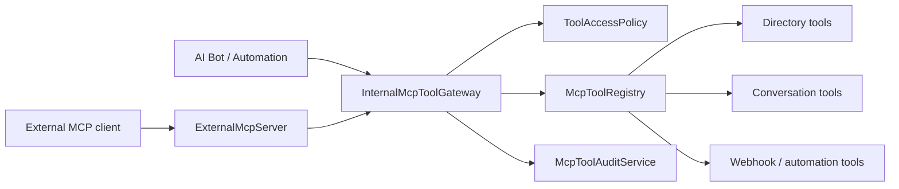

# MCP 受控工具层代码设计

## 结论

需要建设 MCP 能力，但不能将机器人直接连接到业务数据库、内部 HTTP 接口或当前匿名 `/api/mcp/**`。机器人只通过服务端的受控工具网关访问业务能力；网关负责身份、租户、会话范围、审批、审计与限流。

现有 `/api/mcp` 定位为开发信息接口，不作为机器人执行工具的入口。它目前包含配置与端点枚举能力，发布前应从匿名访问中移除，或只保留不含敏感信息的健康检查。

## 两层结构



- **InternalMcpToolGateway**：机器人和自动化的唯一调用入口；不走 HTTP，避免伪造身份。
- **ExternalMcpServer**：未来供 Codex/其他受信 AI 客户端调用；仅转发白名单工具到同一网关，使用独立服务令牌。
- **McpToolRegistry**：工具名、JSON Schema、风险等级、实现的唯一注册表。
- **ToolAccessPolicy**：根据用户、租户、会话成员身份和工具风险等级判定；写操作默认拒绝并要求审批令牌。
- **McpToolAuditService**：记录工具名、调用主体、会话、结果状态、耗时与关联消息 ID；不记录完整提示词、令牌或联系人敏感字段。

## 首批工具（只读）

| MCP 工具名 | 输入 | 输出 | 访问规则 |
| --- | --- | --- | --- |
| `directory.search` | `query`, `limit` | 用户基础资料 | 当前租户、最大 10 条 |
| `conversation.summary` | `conversationId`, `messageLimit` | 去标识化消息摘要素材 | 仅会话成员 |
| `conversation.search` | `conversationId`, `query`, `limit` | 匹配消息 | 仅会话成员 |
| `file.metadata` | `fileId` | 文件名、MIME、大小、状态 | 仅会话成员且不返回下载 URL |
| `automation.status` | `executionId` | 自动化状态与简要错误 | 规则创建者/管理员 |

联系人手机号、发送消息、外部 Webhook、创建任务均属于写入/敏感工具：首期不让模型自动执行，必须走 `propose → 用户确认 → execute` 三段式流程。

## 代码目录与接口

```text
server/.../ai/mcp/
  McpToolDescriptor.java       // name, description, inputSchema, riskLevel
  McpToolInvocation.java       // toolName, arguments, BotToolContext
  McpToolResult.java           // structuredContent, displayText, errorCode
  McpToolHandler.java          // descriptor() + execute(invocation)
  McpToolRegistry.java         // 唯一工具注册与查找
  InternalMcpToolGateway.java  // 鉴权、限流、审计、统一调用
  ToolAccessPolicy.java        // 范围校验与确认令牌校验
  McpToolAuditService.java     // 审计事件写入
  tools/
    DirectorySearchTool.java
    ConversationSummaryTool.java
    FileMetadataTool.java
```

核心契约：

```java
public interface McpToolHandler {
    McpToolDescriptor descriptor();
    McpToolResult execute(McpToolInvocation invocation);
}

public McpToolResult invoke(McpToolInvocation invocation) {
    accessPolicy.requireAllowed(invocation);
    McpToolResult result = registry.require(invocation.toolName()).execute(invocation);
    auditService.record(invocation, result);
    return result;
}
```

`BotToolContext` 必须由服务端从已认证的 `MessageDTO.fromAccountId`、会话成员关系和租户上下文构造；模型输出不得直接填充该对象。

## 对接现有代码的改造顺序

1. `MessageRouter` 构造 `BotToolContext`，不再创建空的 `BotContext`。
2. `AiToolBot` 将 `/user`、`/summary` 等命令改为调用 `InternalMcpToolGateway`，删除绕过权限的 `ToolRegistry.invokeTool`。
3. 将 `UserInfoTool` 改为仅提供业务查询；展示文本由 MCP 工具统一生成并脱敏。
4. `AutomationEngine` 也复用同一个网关，确保机器人和自动化执行完全一致的权限与审计规则。
5. 最后实现 `ExternalMcpServer` 的 `initialize`、`tools/list`、`tools/call`，并移除旧 `/api/mcp/**` 的匿名配置。

## 验收与安全检查

- 非会话成员调用 `conversation.*` 必须返回 `FORBIDDEN`，且不泄露会话是否存在。
- 机器人不可调用未注册工具；参数不符合 Schema 时返回 `INVALID_ARGUMENT`。
- 敏感/写入工具没有确认令牌时返回 `CONFIRMATION_REQUIRED`。
- 审计记录可定位到用户、会话和关联消息，但不包含密码、访问令牌、文件正文、完整联系人资料。
- 工具失败不会中断原始消息投递；机器人只得到可展示的安全错误信息。
