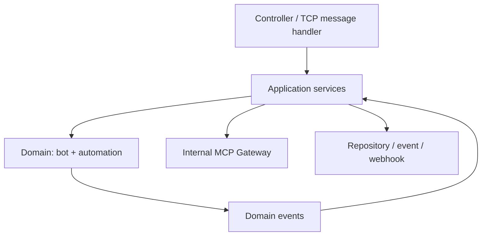
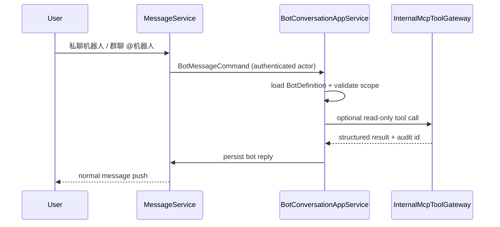

# 聊天机器人与自动化代码抽象大纲

> 本文是《聊天机器人与自动化设计》的实现蓝图；MCP 工具调用的细节见《MCP 受控工具层代码设计》。

## 1. 分层与依赖规则



- `controller` 仅完成鉴权主体解析、DTO 校验与响应转换；不能包含规则匹配或工具调用。
- `application` 编排一次用例和事务边界，例如“发送给机器人”“触发自动化”“确认执行”。
- `domain` 保存不依赖 Spring/HTTP 的状态、规则判断和事件定义。
- `mcp` 是机器人/自动化读取或执行系统能力的唯一入口；禁止 domain 直接访问 Repository。
- `infrastructure` 实现 JPA、异步事件、Webhook HTTP、Redis 幂等与审计。

## 2. 包结构

```text
server/.../bot/
  api/                 BotController, AutomationController, DTO
  application/         BotConversationAppService, AutomationAppService
  domain/
    bot/               BotDefinition, BotSession, BotReplyPlan
    automation/        AutomationRule, AutomationExecution, Trigger, Action
    event/             MessageCreatedEvent, AutomationRequestedEvent
  mcp/                 InternalMcpToolGateway and tool handlers
  infrastructure/
    persistence/       repositories and entity mappers
    event/             transactional event publisher/listener
    webhook/           signed outbound client
    audit/             audit persistence and redaction
```

现有 `server.ai` 中的 `MessageRouter`、`BotHandler` 和 `AiToolBot` 在迁移期保留为适配层；新的业务逻辑放入 `bot.application`，避免在处理器中继续堆叠命令分支。

## 3. 核心领域对象

| 对象 | 关键字段 | 职责 |
| --- | --- | --- |
| `BotDefinition` | `id`, `tenantId`, `name`, `status`, `systemPrompt`, `allowedTools` | 定义可被会话使用的机器人及工具白名单 |
| `BotSession` | `id`, `botId`, `conversationId`, `memberId`, `lastMessageId` | 管理独立机器人聊天的上下文边界 |
| `BotReplyPlan` | `replyType`, `content`, `toolCalls`, `requiresConfirmation` | 将模型/命令意图转为可验证的回复方案 |
| `AutomationRule` | `id`, `trigger`, `condition`, `actions`, `enabled`, `version` | 声明式规则；修改时版本递增 |
| `AutomationExecution` | `id`, `ruleId`, `sourceEventId`, `status`, `attempt`, `idempotencyKey` | 执行实例及重试、审计、结果关联 |
| `ApprovalRequest` | `id`, `executionId`, `actionIndex`, `expiresAt`, `approvedBy` | 写入/敏感工具的用户确认凭证 |

建议枚举：

```java
enum BotStatus { DRAFT, ENABLED, DISABLED, ARCHIVED }
enum TriggerType { MESSAGE_CREATED, MENTIONED, WEBHOOK_RECEIVED, SCHEDULED }
enum ExecutionStatus { PENDING, RUNNING, WAITING_CONFIRMATION, SUCCEEDED, FAILED, CANCELLED }
enum ActionType { REPLY, AI_REPLY, MCP_TOOL, OUTBOUND_WEBHOOK }
```

## 4. 应用服务接口

```java
public interface BotConversationAppService {
    BotReplyPlan handle(BotMessageCommand command, AuthenticatedActor actor);
    MessageDTO<?> persistReply(BotReplyPlan plan, AuthenticatedActor actor);
}

public interface AutomationAppService {
    void onMessageCreated(MessageCreatedEvent event);
    AutomationExecution requestExecution(AutomationRule rule, DomainEvent source);
    AutomationExecution approve(String approvalId, AuthenticatedActor actor);
}

public interface AutomationActionExecutor {
    ActionType supports();
    ActionResult execute(AutomationExecution execution, AutomationAction action);
}
```

`BotConversationAppService` 只负责生成并保存机器人回复；`AutomationAppService` 只负责规则到执行实例；每种 `ActionType` 由独立执行器实现，禁止用大型 `switch` 集中处理。

## 5. 主流程与状态机

### 5.1 聊天进入机器人



机器人回复必须通过现有 `MessageService` 保存和推送，不能再由 Electron 追加临时本地消息；这样多端历史和未读数一致。

### 5.2 自动化执行

```text
PENDING -> RUNNING -> SUCCEEDED
                  -> WAITING_CONFIRMATION -> RUNNING
                  -> FAILED -> (retry) RUNNING
PENDING/RUNNING/WAITING_CONFIRMATION -> CANCELLED
```

`MessageCreatedEvent` 必须在消息事务提交后发布。幂等键为 `ruleId:ruleVersion:sourceEventId`，先写入 `AutomationExecution` 再执行动作；重复事件直接返回既有执行记录。

## 6. API 与 DTO 契约

| Method | Path | 用途 |
| --- | --- | --- |
| `GET` | `/api/bots` | 当前用户可使用的机器人目录 |
| `POST` | `/api/bots/{botId}/messages` | 独立机器人会话消息 |
| `GET` | `/api/automations` | 当前租户规则列表（管理员） |
| `POST` | `/api/automations` | 创建草稿规则 |
| `POST` | `/api/automations/{id}/enable` | 校验后启用规则 |
| `POST` | `/api/automation-executions/{id}/approve` | 确认敏感动作 |
| `GET` | `/api/automation-executions/{id}` | 查询执行状态与安全错误摘要 |

当前已落地的最小审批接口：

| Method | Path | 用途 |
| --- | --- | --- |
| `POST` | `/api/automation/approvals/contact-lookup` | 创建或按客户端请求键复用联系人敏感读取审批 |
| `POST` | `/api/automation/approvals/{approvalId}/decision` | 请求人批准或拒绝；ID 以字符串序列化 |

已批准记录只进入 `APPROVED`，尚未接入实际联系人读取执行器，因此不会因点击批准而泄露数据。

所有外部 ID 以字符串返回。`AutomationRule` 的 `condition` 和 `actions` 采用版本化 JSON，不直接接收可执行脚本：

```json
{
  "trigger": "MENTIONED",
  "condition": { "contains": "日报" },
  "actions": [
    { "type": "AI_REPLY", "botId": "daily-assistant" },
    { "type": "MCP_TOOL", "tool": "conversation.summary", "confirmation": "NONE" }
  ]
}
```

## 7. 安全边界

- 从 Spring Security 的认证用户构造 `AuthenticatedActor`；请求体中的 `fromAccountId` 只做一致性校验，不是授权依据。
- `conversationId` 需先经过成员关系校验，工具与自动化均复用同一个校验服务。
- `MCP_TOOL` 按风险等级处理：只读可直接运行，敏感读取和写入生成 `ApprovalRequest`。
- Webhook 密钥只在服务端加密保存，日志中仅记录密钥标识与目标主机，不记录请求正文。
- 所有用户可见失败信息使用错误码映射，异常堆栈只进入服务端日志和审计记录。

## 8. 实施里程碑

1. 建立本文件的领域契约、数据库实体和 Repository；迁移 AI 回复为服务端持久化消息。
2. 实现 `MESSAGE_CREATED` 事件与 `REPLY` 动作，完成无模型依赖的自动回复闭环。
3. 接入 `directory.search` 与 `conversation.summary` 两个只读 MCP 工具，并将 `/user` 命令迁移到网关。
4. 实现审批、`OUTBOUND_WEBHOOK`、重试、执行审计与管理页面。
5. 将现有匿名 `/api/mcp/**` 下线或收敛为受认证的标准 MCP Server。
