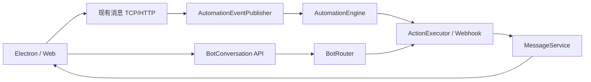

# 聊天机器人与自动化设计

实现层的类职责、状态机、包结构和 API 契约见《[聊天机器人与自动化代码抽象大纲](聊天机器人与自动化代码抽象大纲.md)》；系统能力调用的边界见《[MCP 受控工具层代码设计](MCP受控工具层代码设计.md)》。

## 目标

机器人既可作为独立聊天对象进入，也可在群聊中由 `@机器人` 触发；自动化在服务端执行、留痕并将结果以普通消息或卡片消息投递到会话。客户端只负责展示和发起操作，不保存密钥、不执行工作流。

## 功能模块

| 模块 | 首期能力 | 后续扩展 |
| --- | --- | --- |
| 机器人目录 | AI 助手入口、机器人资料、可用能力 | 多机器人、权限范围、版本发布 |
| 聊天交互 | 独立对话、群聊 @ 触发、流式/卡片回复 | 引用消息、知识库问答、会话记忆 |
| 自动化中心 | 事件触发、条件、动作、启停、手动测试 | 定时任务、审批节点、分支与重试 |
| 连接器 | 安全 Webhook 入站/出站 | 邮件、日历、工单、第三方业务系统 |
| 治理 | 会话/成员权限、脱敏、审计、限流 | 模型额度、DLP、租户级策略 |

## 服务端代码边界

建议新增以下服务端对象：

- `BotDefinition`：机器人身份、系统提示词、工具白名单、启停和租户范围。
- `AutomationRule`：`triggerType`、过滤条件、动作定义、启停状态、创建人。
- `AutomationExecution`：触发事件、输入摘要、状态、重试次数、耗时、错误信息和结果消息 ID。
- `AutomationEventPublisher`：由 `MessageService` 在消息成功落库后发布 `MESSAGE_CREATED`，用异步事务监听器消费。
- `AutomationEngine`：规则匹配、幂等键 `ruleId:messageId`、限流、异步执行和审计。
- `ActionExecutor`：统一执行 `REPLY`、`AI_REPLY`、`WEBHOOK`、`CREATE_TASK` 等动作；所有回复都经现有 `MessageService` 保存与推送。

API 统一为：`/api/bots`（目录与配置）、`/api/automations`（规则 CRUD、启停、测试、执行记录）、`/api/ai-bot/message`（聊天推理）和现有 `/api/ai-bot/webhook/{token}`（外部入站）。所有 ID 以字符串返回给 TypeScript。

## 首期交付顺序

1. 将现有 AI 助手从客户端临时消息改为服务端机器人会话和持久化回复。
2. 上线 `MESSAGE_CREATED -> AutomationEngine -> REPLY/WEBHOOK` 的最小闭环，含幂等、失败记录与重试。
3. 为会话管理员提供群机器人和规则配置页；普通成员仅能使用已启用的机器人。
4. 增加审计、限流、Webhook 签名和工具权限白名单，再开放第三方连接器。
