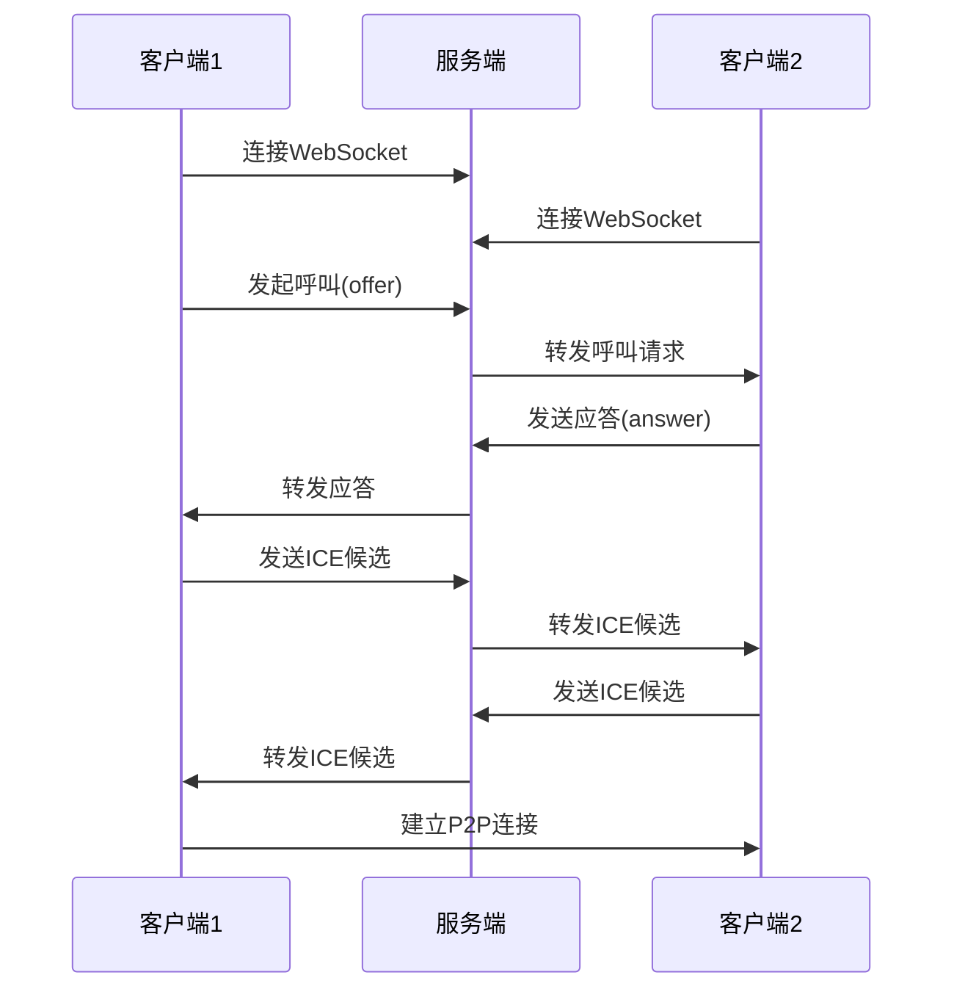

# WebRTC 集成指南

## 概述

本文档描述了如何在系统中集成WebRTC服务端功能，以支持Web和移动客户端的视频通话。

## 架构设计

### 组件说明

1. **WebSocketHandler**: 处理WebSocket连接和实时消息传递
2. **WebrtcService**: 核心WebRTC业务逻辑处理
3. **WebrtcSession**: WebRTC会话模型
4. **WebrtcMessage**: WebRTC消息模型
5. **WebSocketConfig**: WebSocket配置
6. **WebrtcController**: REST API控制器

### 通信流程



## API 接口

### WebSocket 端点

- **连接端点**: `/webrtc`
- **备用连接**: `/webrtc` (使用SockJS)

### STOMP 消息路径

1. **发送WebRTC消息**: `/app/webrtc/message`
2. **发送呼叫请求**: `/app/webrtc/call`
3. **发送应答**: `/app/webrtc/answer`
4. **发送ICE候选**: `/app/webrtc/ice`
5. **发送挂断**: `/app/webrtc/hangup`
6. **发送拒绝**: `/app/webrtc/reject`

### 接收消息队列

1. **接收WebRTC消息**: `/user/queue/webrtc`
2. **接收呼叫请求**: `/user/queue/webrtc/call`
3. **接收应答**: `/user/queue/webrtc/answer`
4. **接收ICE候选**: `/user/queue/webrtc/ice`
5. **接收挂断**: `/user/queue/webrtc/hangup`
6. **接收拒绝**: `/user/queue/webrtc/reject`

### REST API

1. **发起呼叫**: `POST /api/webrtc/call/{calleeId}`
2. **获取会话信息**: `GET /api/webrtc/session/{sessionId}`
3. **结束会话**: `POST /api/webrtc/session/{sessionId}/end`
4. **检查用户状态**: `GET /api/webrtc/user/{userId}/status`

## 使用示例

### 客户端连接

```javascript
// 创建WebSocket连接
const socket = new SockJS('/webrtc');
const stompClient = Stomp.over(socket);

// 连接到服务器
stompClient.connect({}, function (frame) {
    console.log('Connected: ' + frame);
    
    // 订阅WebRTC消息
    stompClient.subscribe('/user/queue/webrtc', function (message) {
        handleMessage(JSON.parse(message.body));
    });
});
```

### 发起呼叫

```javascript
// 发起呼叫
const callMessage = {
    type: 'OFFER',
    to: calleeId,
    payload: offerSdp
};

stompClient.send("/app/webrtc/call", {}, JSON.stringify(callMessage));
```

### 处理ICE候选

```javascript
// 发送ICE候选
const iceMessage = {
    type: 'ICE_CANDIDATE',
    to: remoteUserId,
    payload: JSON.stringify(candidate)
};

stompClient.send("/app/webrtc/ice", {}, JSON.stringify(iceMessage));
```

## 配置说明

### application.yml 配置

```yaml
webrtc:
  session-timeout: 300000  # 会话超时时间(毫秒)
  ice-servers:             # ICE服务器配置
    - url: "stun:stun.l.google.com:19302"
  turn-enabled: false      # 是否启用TURN服务器
  turn-server:             # TURN服务器配置
    url: "turn:localhost:3478"
    username: "username"
    credential: "credential"
    protocols: 
      - "udp"
      - "tcp"
```

## 客户端实现要点

### Web 客户端

1. 使用标准WebRTC API创建RTCPeerConnection
2. 通过WebSocket/STOMP与服务端通信
3. 处理offer/answer交换
4. 收集并发送ICE候选

### 移动客户端

1. Android使用WebRTC库或WebView
2. iOS使用WebRTC框架或WKWebView
3. 实现与Web客户端相同的信令协议

## 部署注意事项

1. **防火墙配置**: 确保WebSocket端口(8080)可访问
2. **SSL证书**: 生产环境建议使用HTTPS和WSS
3. **负载均衡**: 多实例部署时需要sticky sessions或Redis共享状态
4. **TURN服务器**: NAT穿透困难时需要部署TURN服务器

## 测试页面

项目中包含了四个测试页面，可用于验证WebRTC功能：

1. **完整测试页面**: `/static/webrtc-test.html` - 提供完整的控制界面
2. **简化测试页面**: `/static/simple-webrtc.html` - 更易于使用的简化版本
3. **免认证测试页面**: `/static/webrtc-test-noauth.html` - 无需用户认证即可测试
4. **改进版测试页面**: `/static/webrtc-improved.html` - 基于userId的改进版通信测试

使用测试页面的步骤：
1. 在两个不同的浏览器窗口或标签页中打开测试页面
2. 在每个窗口中输入不同的用户ID (例如: user1 和 user2)
3. 点击"设置用户ID"确认身份
4. 点击"启动摄像头"获取本地视频
5. 点击"连接服务器"建立WebSocket连接
6. 在一个窗口中输入对方的用户ID，然后点击"呼叫对方"
7. 在另一个窗口中等待自动接听来电

## 移动端集成

移动端可以使用专门的API接口与服务端通信，详细信息请参考 [移动端WebRTC API文档](mobile_webrtc_api.md)

## 扩展建议

1. **录制功能**: 集成媒体服务器实现通话录制
2. **群组通话**: 扩展实现多方视频通话
3. **通话统计**: 添加通话质量监控和统计
4. **安全增强**: 实现呼叫鉴权和加密传输