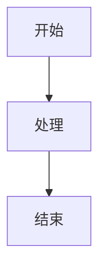

# 文档标题

## 概述
简要说明文档目的和适用范围（100-300 字）

**适用对象**: 开发人员/运维人员/测试人员  
**最后更新**: 2025-XX-XX  
**版本**: v1.0

---

## 背景/前言
说明编写本文档的背景、原因和必要性

## 目标
通过阅读本文档，读者能够:
- 了解/掌握...
- 学会如何...
- 完成...任务

## 前置条件
阅读前需要了解的知识或准备工作:
- [ ] 已安装 JDK 21
- [ ] 已配置 Maven 环境
- [ ] 了解 Spring Boot 基础

## 核心概念（可选）
解释关键术语和概念

### 术语 1
解释...

### 术语 2
解释...

## 主体内容

### 1. 第一部分

#### 1.1 子主题
内容...

#### 1.2 子主题
内容...

### 2. 第二部分

#### 2.1 操作步骤
分步骤说明:
1. 第一步
   ```bash
   # 示例命令
   command here
   ```
2. 第二步
3. 第三步

#### 2.2 代码示例
```java
// Java 代码示例
public class Example {
    public static void main(String[] args) {
        System.out.println("Hello");
    }
}
```

#### 2.3 配置示例
```yaml
# YAML 配置示例
server:
  port: 8080
  address: 0.0.0.0
```

### 3. 第三部分

#### 3.1 表格示例
| 参数 | 类型 | 必填 | 说明 |
|-----|------|-----|------|
| name | String | 是 | 名称 |
| age | Integer | 否 | 年龄 |

#### 3.2 图表引用


或者使用 Mermaid:


## 实践案例（可选）

### 案例 1: 场景描述
**需求**: ...

**解决方案**:
1. ...
2. ...

**结果**: ...

## 常见问题 (FAQ)

### Q1: 问题描述？
**A**: 
详细解答...

### Q2: 另一个问题？
**A**: 
解答...

### Q3: 更多问题？
**A**: 
解答...

## 最佳实践
- ✅ 推荐做法 1
- ✅ 推荐做法 2
- ❌ 避免做法 1
- ❌ 避免做法 2

## 性能优化建议（可选）
- 优化点 1
- 优化点 2
- 优化点 3

## 故障排查

### 问题 1
**现象**: ...

**原因**: ...

**解决方案**: 
```bash
# 解决命令
```

### 问题 2
**现象**: ...

**原因**: ...

**解决方案**: ...

## 参考资料
- [相关文档 1](链接)
- [相关文档 2](链接)
- [官方文档](链接)

## 更新日志
- 2025-XX-XX: 初始版本
- 2025-XX-XX: 添加了 XXX 章节
- 2025-XX-XX: 修复了 XXX 错误

## 附录（可选）

### A. 相关配置文件
完整配置文件示例...

### B. 脚本文件
完整脚本内容...

### C. 检查清单
部署前检查:
- [ ] 检查项 1
- [ ] 检查项 2
- [ ] 检查项 3

---

**文档维护**: 作者姓名/团队  
**联系方式**: email@example.com  
**审核人**: 审核者姓名
