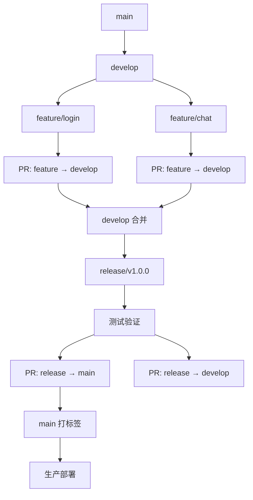

# Group IM CI/CD 标准流程

## 概述

本文档详细描述 Group IM 项目的持续集成和持续部署 (CI/CD) 标准流程，基于 GitHub Actions + 阿里云 ECS + 宝塔面板实现自动化构建、测试和部署。

**适用对象**: 开发人员、运维人员  
**最后更新**: 2025-03-12  
**版本**: v1.0

---

## 一、架构设计

### 1.1 CI/CD 流程图

```
┌─────────────┐    ┌──────────────┐    ┌─────────────┐    ┌──────────────┐
│   Developer │───▶│  GitHub PR   │───▶│  GitHub     │───▶│  Docker      │
│             │    │              │    │  Actions    │    │  Registry    │
└─────────────┘    └──────────────┘    └─────────────┘    └──────────────┘
                                                          │
                                                          ▼
┌─────────────┐    ┌──────────────┐    ┌─────────────┐    ┌──────────────┐
│   生产环境   │◀───│   宝塔面板   │◀───│  SSH 部署    │◀───│  镜像拉取    │
│  (阿里云)    │    │  (运维管理)   │    │             │    │              │
└─────────────┘    └──────────────┘    └─────────────┘    └──────────────┘
```

### 1.2 技术栈

#### 代码托管
- **平台**: GitHub
- **分支策略**: Git Flow

#### CI/CD 工具
- **CI**: GitHub Actions
- **CD**: GitHub Actions + SSH + 宝塔面板

#### 构建工具
- **后端**: Maven (Java 21)
- **前端**: Gradle (KMP)

#### 容器化
- **Docker**: 应用容器化
- **Docker Compose**: 服务编排

#### 部署目标
- **服务器**: 阿里云 ECS
- **运维**: 宝塔面板
- **运行环境**: Docker + Docker Compose

---

## 二、分支管理策略

### 2.1 分支定义

| 分支类型 | 命名规则 | 说明 | 保护级别 |
|---------|---------|------|---------|
| 主分支 | `main` | 生产环境代码，随时可部署 | 🔒 受保护 |
| 开发分支 | `develop` | 日常开发集成分支 | 🔒 受保护 |
| 功能分支 | `feature/xxx` | 新功能开发 | 临时 |
| 发布分支 | `release/vX.Y.Z` | 版本发布准备 | 临时 |
| 热修复分支 | `hotfix/xxx` | 生产环境紧急修复 | 临时 |

### 2.2 工作流



### 2.3 分支保护规则

#### main 分支
- ✅ 需要至少 1 人审核
- ✅ 需要 CI 检查通过
- ✅ 禁止直接 push
- ✅ 必须通过 PR 合并

#### develop 分支
- ✅ 需要至少 1 人审核
- ✅ 需要 CI 检查通过
- ✅ 禁止直接 push

---

## 三、持续集成 (CI) 流程

### 3.1 CI 触发条件

```yaml
触发事件:
  - pull_request 到 main 分支
  - pull_request 到 develop 分支
  - push 到 develop 分支
  - 手动触发
```

### 3.2 CI 工作流详解

#### 阶段 1: 代码质量检查
```yaml
步骤:
  1. 代码检出
  2. JDK 21 环境配置
  3. Maven 依赖缓存
  4. 代码格式检查 (Spotless)
  5. 代码静态分析 (SonarQube)
```

#### 阶段 2: 编译构建
```yaml
步骤:
  1. 编译后端代码 (Maven)
  2. 编译前端代码 (Gradle)
  3. 打包构建产物
```

#### 阶段 3: 自动化测试
```yaml
步骤:
  1. 单元测试 (Spock + JUnit)
  2. 集成测试
  3. 生成测试报告
  4. 代码覆盖率检查 (>80%)
```

#### 阶段 4: 构建 Docker 镜像
```yaml
步骤:
  1. 构建 Docker 镜像
  2. 推送至 Docker Hub / ACR
  3. 保存构建产物
```

### 3.3 GitHub Actions 配置文件

创建 `.github/workflows/ci.yml`:

```yaml
name: CI Pipeline

on:
  pull_request:
    branches: [ main, develop ]
  push:
    branches: [ develop ]
  workflow_dispatch:

env:
  JAVA_VERSION: '21'
  NODE_VERSION: '18'
  DOCKER_REGISTRY: docker.io
  DOCKER_IMAGE_NAME: your-username/group-im-server

jobs:
  # ========== 代码质量检查 ==========
  code-quality:
    name: Code Quality Check
    runs-on: ubuntu-latest
    
    steps:
      - name: Checkout code
        uses: actions/checkout@v4
      
      - name: Set up JDK 21
        uses: actions/setup-java@v4
        with:
          java-version: ${{ env.JAVA_VERSION }}
          distribution: 'temurin'
          cache: maven
      
      - name: Cache Maven dependencies
        uses: actions/cache@v4
        with:
          path: ~/.m2/repository
          key: ${{ runner.os }}-maven-${{ hashFiles('**/pom.xml') }}
          restore-keys: |
            ${{ runner.os }}-maven-
      
      - name: Code format check
        run: mvn spotless:check -pl server
      
      - name: Static code analysis
        run: mvn sonar:sonar -pl server
        env:
          SONAR_TOKEN: ${{ secrets.SONAR_TOKEN }}
          SONAR_HOST_URL: ${{ secrets.SONAR_HOST_URL }}

  # ========== 编译构建 ==========
  build:
    name: Build Application
    runs-on: ubuntu-latest
    needs: code-quality
    
    outputs:
      version: ${{ steps.version.outputs.version }}
    
    steps:
      - name: Checkout code
        uses: actions/checkout@v4
      
      - name: Set up JDK 21
        uses: actions/setup-java@v4
        with:
          java-version: ${{ env.JAVA_VERSION }}
          distribution: 'temurin'
          cache: maven
      
      - name: Build with Maven
        run: mvn clean package -DskipTests -pl server
      
      - name: Get version
        id: version
        run: echo "version=$(mvn help:evaluate -Dexpression=project.version -q -DforceStdout)" >> $GITHUB_OUTPUT
      
      - name: Upload artifact
        uses: actions/upload-artifact@v4
        with:
          name: server-jar
          path: server/target/server-*.jar
          retention-days: 7

  # ========== 自动化测试 ==========
  test:
    name: Run Tests
    runs-on: ubuntu-latest
    needs: build
    
    services:
      postgres:
        image: postgres:14
        env:
          POSTGRES_DB: group_test
          POSTGRES_USER: postgres
          POSTGRES_PASSWORD: postgres
        options: >-
          --health-cmd pg_isready
          --health-interval 10s
          --health-timeout 5s
          --health-retries 5
        ports:
          - 5432:5432
      
      redis:
        image: redis:7-alpine
        options: >-
          --health-cmd "redis-cli ping"
          --health-interval 10s
          --health-timeout 5s
          --health-retries 5
        ports:
          - 6379:6379
    
    steps:
      - name: Checkout code
        uses: actions/checkout@v4
      
      - name: Set up JDK 21
        uses: actions/setup-java@v4
        with:
          java-version: ${{ env.JAVA_VERSION }}
          distribution: 'temurin'
          cache: maven
      
      - name: Run unit tests
        run: mvn test -pl server
        env:
          DB_IP: localhost
          DB_PORT: 5432
          DB_USER: postgres
          DB_PASSWORD: postgres
          REDIS_HOST: localhost
          REDIS_PORT: 6379
      
      - name: Generate coverage report
        run: mvn jacoco:report -pl server
      
      - name: Upload coverage report
        uses: codecov/codecov-action@v4
        with:
          file: server/target/site/jacoco/jacoco.xml
          flags: backend
          fail_ci_if_error: false

  # ========== Docker 镜像构建 ==========
  docker-build:
    name: Build Docker Image
    runs-on: ubuntu-latest
    needs: [build, test]
    if: github.event_name == 'push' && github.ref == 'refs/heads/develop' || startsWith(github.ref, 'refs/tags/')
    
    steps:
      - name: Checkout code
        uses: actions/checkout@v4
      
      - name: Download artifact
        uses: actions/download-artifact@v4
        with:
          name: server-jar
          path: server/target/
      
      - name: Set up Docker Buildx
        uses: docker/setup-buildx-action@v3
      
      - name: Login to Docker Hub
        uses: docker/login-action@v3
        with:
          username: ${{ secrets.DOCKER_USERNAME }}
          password: ${{ secrets.DOCKER_PASSWORD }}
      
      - name: Extract metadata
        id: meta
        uses: docker/metadata-action@v5
        with:
          images: ${{ env.DOCKER_IMAGE_NAME }}
          tags: |
            type=ref,event=branch
            type=semver,pattern={{version}}
            type=sha,prefix=sha-
      
      - name: Build and push
        uses: docker/build-push-action@v5
        with:
          context: .
          file: server/Dockerfile
          push: true
          tags: ${{ steps.meta.outputs.tags }}
          labels: ${{ steps.meta.outputs.labels }}
          cache-from: type=registry,ref=${{ env.DOCKER_IMAGE_NAME }}:buildcache
          cache-to: type=registry,ref=${{ env.DOCKER_IMAGE_NAME }}:buildcache,mode=max
```

---

## 四、持续部署 (CD) 流程

### 4.1 CD 触发条件

```yaml
触发事件:
  - CI 成功完成（develop 分支）
  - 创建 Release Tag
  - 手动触发部署
```

### 4.2 部署环境

#### 测试环境
- **自动部署**: develop 分支 CI 成功后
- **域名**: test.group-im.com
- **数据库**: PostgreSQL (测试库)

#### 生产环境
- **手动确认**: 需要人工审批
- **域名**: api.group-im.com
- **数据库**: PostgreSQL (生产库)

### 4.3 宝塔面板配置

#### 前置准备

1. **安装宝塔面板**
```bash
# CentOS/Ubuntu/Debian
curl -o install.sh https://download.bt.cn/install/install_6.0.sh && sh install.sh
```

2. **安装必要插件**
```
已安装插件:
- Docker 管理器
- Nginx 反向代理
- PostgreSQL 数据库
- Redis 数据库
- SSL 证书管理
```

3. **配置环境变量**
在宝塔面板中设置：
```bash
DB_IP=postgres
DB_PORT=5432
DB_USER=postgres
DB_PASSWORD=${{ secrets.DB_PASSWORD }}
REDIS_HOST=redis
REDIS_PORT=6379
JWT_SECRET=${{ secrets.JWT_SECRET }}
```

### 4.4 CD 工作流配置

创建 `.github/workflows/cd.yml`:

```yaml
name: CD Pipeline

on:
  workflow_run:
    workflows: ["CI Pipeline"]
    types:
      - completed
    branches: [ develop ]
  release:
    types: [ published ]
  workflow_dispatch:
    inputs:
      environment:
        description: '部署环境'
        required: true
        default: 'test'
        type: choice
        options:
          - test
          - production

env:
  DOCKER_IMAGE_NAME: your-username/group-im-server
  SERVER_HOST: ${{ secrets.SERVER_HOST }}
  SERVER_USER: ${{ secrets.SERVER_USER }}

jobs:
  # ========== 部署到测试环境 ==========
  deploy-test:
    name: Deploy to Test Environment
    runs-on: ubuntu-latest
    if: |
      github.event_name == 'workflow_run' && 
      github.event.workflow_run.conclusion == 'success'
    
    steps:
      - name: Checkout code
        uses: actions/checkout@v4
      
      - name: Get image tag
        id: image-tag
        run: echo "tag=sha-${{ github.sha }}" >> $GITHUB_OUTPUT
      
      - name: Deploy via SSH
        uses: appleboy/ssh-action@master
        with:
          host: ${{ env.SERVER_HOST }}
          username: ${{ env.SERVER_USER }}
          key: ${{ secrets.SSH_PRIVATE_KEY }}
          script: |
            cd /www/wwwroot/group-im
            
            # 拉取最新镜像
            docker pull ${{ env.DOCKER_IMAGE_NAME }}:${{ steps.image-tag.outputs.tag }}
            
            # 停止旧容器
            docker-compose down
            
            # 更新镜像标签
            sed -i "s|image:.*server.*|image: ${{ env.DOCKER_IMAGE_NAME }}:${{ steps.image-tag.outputs.tag }}|" docker-compose.test.yml
            
            # 启动新容器
            docker-compose -f docker-compose.test.yml up -d
            
            # 清理旧镜像
            docker image prune -f
            
            # 检查服务健康状态
            sleep 10
            curl -f http://localhost:8080/actuator/health || exit 1

  # ========== 部署到生产环境 ==========
  deploy-production:
    name: Deploy to Production
    runs-on: ubuntu-latest
    if: github.event_name == 'release' || github.event_name == 'workflow_dispatch'
    environment: production
    
    steps:
      - name: Checkout code
        uses: actions/checkout@v4
      
      - name: Wait for approval
        if: github.event_name == 'workflow_dispatch'
        run: echo "等待生产环境部署审批..."
      
      - name: Get release tag
        id: release-tag
        if: github.event_name == 'release'
        run: echo "tag=${{ github.event.release.tag_name }}" >> $GITHUB_OUTPUT
      
      - name: Deploy via SSH
        uses: appleboy/ssh-action@master
        with:
          host: ${{ env.SERVER_HOST }}
          username: ${{ env.SERVER_USER }}
          key: ${{ secrets.SSH_PRIVATE_KEY }}
          script: |
            cd /www/wwwroot/group-im
            
            # 备份当前版本
            docker-compose ps > backup-$(date +%Y%m%d-%H%M%S).txt
            
            # 拉取生产镜像
            docker pull ${{ env.DOCKER_IMAGE_NAME }}:${{ steps.release-tag.outputs.tag || github.event.inputs.version }}
            
            # 停止服务
            docker-compose down
            
            # 使用生产配置
            export ENV_FILE=.env.production
            
            # 启动服务
            docker-compose -f docker-compose.prod.yml up -d
            
            # 等待服务启动
            sleep 15
            
            # 健康检查
            HEALTH_STATUS=$(curl -s http://localhost:8080/actuator/health)
            if [[ "$HEALTH_STATUS" == *"UP"* ]]; then
              echo "✅ 生产环境部署成功"
            else
              echo "❌ 生产环境部署失败，开始回滚"
              # 回滚逻辑
              exit 1
            fi
      
      - name: Notify deployment result
        if: always()
        uses: slackapi/slack-github-action@v1.25.0
        with:
          payload: |
            {
              "text": "生产环境部署 ${{ job.status }}",
              "environment": "production",
              "version": "${{ steps.release-tag.outputs.tag || github.event.inputs.version }}"
            }
        env:
          SLACK_WEBHOOK_URL: ${{ secrets.SLACK_WEBHOOK_URL }}
```

---

## 五、服务器配置

### 5.1 阿里云 ECS 配置

#### 基础配置
- **实例规格**: ecs.c6.xlarge (4 vCPU, 8 GiB)
- **操作系统**: Ubuntu 22.04 LTS
- **存储**: 100GB ESSD
- **网络**: 按量付费带宽

#### 安全组规则
| 端口 | 协议 | 授权对象 | 说明 |
|-----|------|---------|------|
| 22 | TCP | 0.0.0.0/0 | SSH |
| 80 | TCP | 0.0.0.0/0 | HTTP |
| 443 | TCP | 0.0.0.0/0 | HTTPS |
| 8080 | TCP | 0.0.0.0/0 | 应用服务 |
| 8088 | TCP | 0.0.0.0/0 | TCP 长连接 |

### 5.2 宝塔面板项目配置

#### 目录结构
```bash
/www/wwwroot/group-im/
├── docker-compose.yml          # 标准配置
├── docker-compose.test.yml     # 测试环境配置
├── docker-compose.prod.yml     # 生产环境配置
├── .env                        # 环境变量
├── .env.production             # 生产环境变量
├── nginx/
│   └── conf.d/
│       └── group-im.conf       # Nginx 配置
└── logs/                       # 日志目录
```

#### Nginx 反向代理配置
创建 `/www/server/panel/vhost/nginx/group-im.conf`:

```nginx
server {
    listen 80;
    server_name api.group-im.com;
    
    location / {
        proxy_pass http://localhost:8080;
        proxy_set_header Host $host;
        proxy_set_header X-Real-IP $remote_addr;
        proxy_set_header X-Forwarded-For $proxy_add_x_forwarded_for;
        proxy_set_header X-Forwarded-Proto $scheme;
        
        # WebSocket 支持
        proxy_http_version 1.1;
        proxy_set_header Upgrade $http_upgrade;
        proxy_set_header Connection "upgrade";
        
        # 超时设置
        proxy_connect_timeout 60s;
        proxy_send_timeout 60s;
        proxy_read_timeout 60s;
    }
    
    # 健康检查端点
    location /health {
        proxy_pass http://localhost:8080/actuator/health;
        access_log off;
    }
}
```

### 5.3 Docker Compose 配置

#### docker-compose.prod.yml
```yaml
version: '3.8'

services:
  app:
    image: your-username/group-im-server:latest
    container_name: group-im-app
    restart: always
    ports:
      - "8080:8080"
      - "8088:8088"
    environment:
      - SPRING_PROFILES_ACTIVE=prod
      - DB_IP=postgres
      - DB_PORT=5432
      - DB_USER=postgres
      - DB_PASSWORD=${DB_PASSWORD}
      - REDIS_HOST=redis
      - REDIS_PORT=6379
    depends_on:
      postgres:
        condition: service_healthy
      redis:
        condition: service_healthy
    volumes:
      - ./logs:/app/logs
      - ./uploads:/app/uploads
    networks:
      - group-im-network
    healthcheck:
      test: ["CMD", "curl", "-f", "http://localhost:8080/actuator/health"]
      interval: 30s
      timeout: 10s
      retries: 3
  
  postgres:
    image: postgres:14-alpine
    container_name: group-im-postgres
    restart: always
    environment:
      POSTGRES_DB: group
      POSTGRES_USER: postgres
      POSTGRES_PASSWORD: ${DB_PASSWORD}
    volumes:
      - postgres-data:/var/lib/postgresql/data
    networks:
      - group-im-network
    healthcheck:
      test: ["CMD-SHELL", "pg_isready -U postgres"]
      interval: 10s
      timeout: 5s
      retries: 5
  
  redis:
    image: redis:7-alpine
    container_name: group-im-redis
    restart: always
    command: redis-server --requirepass ${REDIS_PASSWORD}
    volumes:
      - redis-data:/data
    networks:
      - group-im-network
    healthcheck:
      test: ["CMD", "redis-cli", "ping"]
      interval: 10s
      timeout: 5s
      retries: 5

volumes:
  postgres-data:
  redis-data:

networks:
  group-im-network:
    driver: bridge
```

---

## 六、密钥管理

### 6.1 GitHub Secrets 配置

在 GitHub 仓库 Settings → Secrets and variables → Actions 中配置:

```bash
# 服务器相关
SERVER_HOST=your.server.ip.address
SERVER_USER=root
SSH_PRIVATE_KEY=<SSH 私钥内容>

# Docker 相关
DOCKER_USERNAME=your-docker-username
DOCKER_PASSWORD=your-docker-password

# 数据库相关
DB_PASSWORD=your-db-password
REDIS_PASSWORD=your-redis-password

# JWT 相关
JWT_SECRET=your-jwt-secret

# 监控通知
SLACK_WEBHOOK_URL=https://hooks.slack.com/services/YOUR/WEBHOOK/URL

# SonarQube
SONAR_TOKEN=your-sonar-token
SONAR_HOST_URL=https://sonarqube.example.com
```

### 6.2 服务器环境变量

创建 `/www/wwwroot/group-im/.env.production`:

```bash
# 数据库配置
DB_PASSWORD=your-production-db-password
DB_IP=postgres
DB_PORT=5432
DB_USER=postgres

# Redis 配置
REDIS_PASSWORD=your-production-redis-password
REDIS_HOST=redis
REDIS_PORT=6379

# JWT 配置
JWT_SECRET=your-production-jwt-secret

# 应用配置
SPRING_PROFILES_ACTIVE=prod
LOG_LEVEL=INFO
```

---

## 七、监控与日志

### 7.1 应用监控

#### Spring Boot Actuator
```yaml
management:
  endpoints:
    web:
      exposure:
        include: health,info,metrics,prometheus
  endpoint:
    health:
      show-details: always
  metrics:
    export:
      prometheus:
        enabled: true
```

访问端点:
- 健康检查: `http://api.group-im.com/actuator/health`
- 指标数据: `http://api.group-im.com/actuator/metrics`
- Prometheus: `http://api.group-im.com/actuator/prometheus`

### 7.2 日志管理

#### 日志配置
```yaml
logging:
  level:
    root: INFO
    com.github.im: DEBUG
  file:
    name: /app/logs/application.log
  logback:
    rollingpolicy:
      max-file-size: 100MB
      max-history: 30
```

#### 日志查看（宝塔面板）
1. 进入宝塔面板 → Docker → 容器
2. 点击 `group-im-app` 容器的"日志"按钮
3. 实时查看或下载日志文件

### 7.3 告警配置

#### 钉钉告警（可选）
在宝塔面板设置监控任务:
- 监控 URL: `http://localhost:8080/actuator/health`
- 检测频率: 每 5 分钟
- 失败次数: 连续 3 次
- 告警方式: 钉钉机器人 Webhook

---

## 八、回滚策略

### 8.1 一键回滚脚本

创建 `/www/wwwroot/group-im/scripts/rollback.sh`:

```bash
#!/bin/bash

# 回滚到上一个版本
set -e

IMAGE_NAME="your-username/group-im-server"
CONTAINER_NAME="group-im-app"

echo "🔄 开始回滚..."

# 获取当前运行的镜像版本
CURRENT_TAG=$(docker inspect --format='{{.Config.Image}}' $CONTAINER_NAME | cut -d':' -f2)
echo "当前版本：$CURRENT_TAG"

# 获取历史镜像列表
HISTORY=$(docker images --format "{{.Tag}}" | grep -v "<none>" | sort -V)
PREVIOUS_TAG=$(echo "$HISTORY" | head -n1)

if [ "$PREVIOUS_TAG" == "$CURRENT_TAG" ]; then
    PREVIOUS_TAG=$(echo "$HISTORY" | head -n2 | tail -n1)
fi

echo "回滚目标版本：$PREVIOUS_TAG"

if [ -z "$PREVIOUS_TAG" ]; then
    echo "❌ 未找到可回滚的版本"
    exit 1
fi

# 停止当前容器
docker-compose down

# 启动旧版本
sed -i "s|image:.*server.*|image: $IMAGE_NAME:$PREVIOUS_TAG|" docker-compose.prod.yml
docker-compose -f docker-compose.prod.yml up -d

echo "✅ 回滚完成，当前版本：$PREVIOUS_TAG"

# 健康检查
sleep 10
curl -f http://localhost:8080/actuator/health || echo "⚠️  服务健康检查失败，请检查日志"
```

### 8.2 数据库回滚

```bash
# 如果涉及数据库变更，需要准备回滚 SQL
# 使用 Flyway 或 Liquibase 管理数据库版本
```

---

## 九、性能优化

### 9.1 JVM 优化

```yaml
# Dockerfile 中添加
ENV JAVA_OPTS="-Xms512m -Xmx2g -XX:+UseG1GC -XX:MaxGCPauseMillis=200"
```

### 9.2 数据库优化

```sql
-- PostgreSQL 配置优化
shared_buffers = 256MB
effective_cache_size = 1GB
work_mem = 64MB
maintenance_work_mem = 128MB
```

### 9.3 Redis 优化

```yaml
# Redis 配置
maxmemory: 512mb
maxmemory-policy: allkeys-lru
```

---

## 十、常见问题 (FAQ)

### Q1: CI 构建失败怎么办？
**A**: 
1. 查看 GitHub Actions 日志
2. 本地重现构建：`mvn clean package`
3. 检查依赖版本兼容性
4. 清除缓存重试

### Q2: 部署后服务无法访问？
**A**:
1. 检查安全组端口配置
2. 查看容器日志：`docker logs group-im-app`
3. 检查 Nginx 配置：`nginx -t`
4. 验证防火墙规则

### Q3: 数据库连接失败？
**A**:
1. 检查 PostgreSQL 容器状态
2. 验证数据库密码正确性
3. 确认网络连通性
4. 查看数据库日志

### Q4: 如何查看历史部署记录？
**A**:
```bash
# 查看 GitHub Actions 历史记录
https://github.com/your-org/Group/actions

# 查看服务器部署历史
cd /www/wwwroot/group-im
ls -la backup-*.txt
```

### Q5: 如何临时关闭自动部署？
**A**:
1. GitHub Settings → Actions → 禁用工作流
2. 或在宝塔面板停止对应服务
3. 或注释掉 CI/CD 配置文件

---

## 十一、最佳实践

### 11.1 提交规范

遵循 Conventional Commits:
```
feat: 新增功能
fix: 修复 bug
docs: 文档更新
style: 代码格式调整
refactor: 重构代码
test: 测试相关
chore: 构建/工具链相关
```

### 11.2 版本号规则

遵循 SemVer 语义化版本:
```
主版本号。次版本号.修订号
例如：1.2.3

重大更新：X.0.0
功能更新：1.Y.0
Bug 修复：1.2.Z
```

### 11.3 发布检查清单

部署前检查:
- [ ] 所有测试通过
- [ ] 代码审查完成
- [ ] 更新日志编写完成
- [ ] 数据库迁移脚本准备
- [ ] 回滚方案准备
- [ ] 相关人员通知到位

---

## 十二、参考资料

### 官方文档
- [GitHub Actions 文档](https://docs.github.com/en/actions)
- [Spring Boot 部署指南](https://spring.io/guides)
- [Docker 官方文档](https://docs.docker.com/)
- [宝塔面板教程](https://www.bt.cn/bbs/)

### 相关工具
- [Spotless 代码格式化](https://github.com/diffplug/spotless)
- [SonarQube 代码质量](https://www.sonarqube.org/)
- [Prometheus 监控](https://prometheus.io/)

---

**文档维护**: 开发团队  
**最后更新**: 2025-03-12  
**版本**: v1.0
