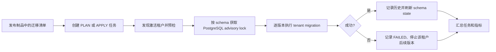

# 租户 Schema 版本与迁移机制方案

## 1. 结论

现有 `POST /api/organization/company/sync-schema` 可以作为过渡期的人工补救入口，但不能作为生产环境的 Schema 发布机制。应替换为**版本化、不可变、逐租户可审计、可恢复**的迁移系统。

仅在 `company` 表或每个 schema 放一个 version 字段也不够。可靠机制至少需要：迁移清单、每个租户已执行的迁移历史、迁移运行记录、互斥锁、失败状态、校验和，以及结构漂移检测。

目标状态：发布人员可以准确回答“哪些租户处于哪个版本、哪些待升级、哪一步失败、能否安全重试”。

## 2. 现状与风险

当前接口调用 `public.create_or_sync_company_schema(schemaName, companyId)`；`CompanyService.syncSchemas` 会遍历目标公司并调用它。

但当前实现有以下限制：

- 没有记录目标 schema 的版本、已执行步骤、执行时间或失败原因。
- 单个租户异常会在循环内被记录后继续处理，控制器仍可能返回“同步完成”，因此不能据 HTTP 200 判断成功。
- `create_or_sync_company_schema` 以 `public` schema 为模板，只补不存在的列。它不表达有顺序的数据迁移，也不能可靠处理列类型、长度、`NOT NULL`、默认值、生成列、删除/重命名、约束和索引变更。
- 通过 `information_schema.columns.data_type` 补列会丢失 `varchar` 长度、默认值和非空等定义。
- 依赖 Hibernate `ddl-auto: update` 只能在启动期间处理其看到的 schema；它不是多租户数据库发布工具，也没有审计与回滚语义。
- 当前接口以用户名 `admin` 判断权限，不能表达发布角色、审批和操作审计。

因此，`conversation_members.role` 这类“新增列 + 历史数据回填 + 非空约束”的变更不应继续依赖全表结构复制。

## 3. 设计原则

1. **迁移脚本是唯一事实来源**：版本一旦发布不可修改；改动必须新增版本。
2. **每个租户独立记录进度**：同一版本可在不同租户有不同状态。
3. **迁移与应用解耦**：生产应用设置 `ddl-auto: validate`（或 `none`），DDL 只由迁移执行器运行。
4. **失败可见、可重试、不可伪成功**：任一目标失败后，任务必须标记为 `PARTIAL_FAILED` 或 `FAILED`。
5. **向前兼容优先**：采用 expand → migrate/backfill → switch → contract，避免发布时长时间停机。
6. **不自动回滚数据**：失败时停止后续版本、保留错误与现场；仅为明确安全的变更提供单独的 repair/rollback 脚本。

## 4. 迁移定义

建议引入 Flyway（或在现有项目中实现同等语义的轻量执行器），迁移文件纳入 Git，按以下目录管理：

```text
server/src/main/resources/db/migration/
  public/
    V202608140001__create_schema_migration_control_tables.sql
  tenant/
    V202608140010__conversation_member_role.sql
    V202608140020__conversation_member_role_indexes.sql
```

文件名包含严格递增版本与说明。每个文件保存 SHA-256 校验和；同一版本的内容变更将被拒绝执行并报警。

`public/` 迁移只管理控制面表、全局元数据和公共表；`tenant/` 迁移在每个公司 schema 的连接内执行。租户 SQL 不引用硬编码 schema 名称，执行器通过已校验的 `connection.setSchema(schemaName)`（或安全的 `SET LOCAL search_path`）设定目标。

新建租户时：创建空 schema、授予最小权限、按顺序执行全部 `tenant/` 迁移，再创建仅用于全局表的受控视图。不要再从 `public` 使用 `LIKE ... INCLUDING ALL` 复制整个表结构。

## 5. 控制面数据模型

这些表位于 `public` schema，由迁移执行器专用账号写入。

| 表 | 关键字段 | 用途 |
| --- | --- | --- |
| `schema_migration_catalog` | `version`、`scope`、`description`、`checksum`、`transactional`、`introduced_in_release` | 已随制品发布的迁移清单；可由启动时扫描资源校验写入。 |
| `tenant_schema_migration` | `company_id`、`schema_name`、`version`、`checksum`、`status`、`installed_at`、`duration_ms`、`error_message` | 每个租户、每个版本的执行历史；`(company_id, version)` 唯一。 |
| `tenant_schema_state` | `company_id`、`schema_name`、`current_version`、`target_version`、`status`、`last_success_at`、`last_error` | 租户的快速状态投影：`UP_TO_DATE`、`PENDING`、`MIGRATING`、`FAILED`、`DRIFTED`、`DISABLED`。 |
| `schema_migration_run` | `run_id`、`requested_by`、`request_scope`、`mode`、`release`、`status`、`started_at`、`finished_at` | 一次批量操作的审计与汇总。 |
| `schema_migration_run_item` | `run_id`、`company_id`、`from_version`、`target_version`、`status`、`attempt`、`error` | 一次运行中每个租户的结果。 |

`current_version` 是历史表成功记录的缓存，不能成为唯一依据。真实依据是按版本与 checksum 保存的不可变执行历史。

## 6. 执行流程



具体规则：

1. API 先创建 `schema_migration_run`，异步 worker 执行，立即返回 `runId`；不能在 HTTP 请求线程内跑全量 DDL。
2. 执行前检查目标租户是否 active、schema 是否存在、数据库权限、当前版本/校验和、磁盘空间和待执行计划。
3. 每个 schema 使用 `pg_advisory_lock(hashtext('tenant-schema:' || schema_name))` 互斥，防止多实例或重复点击并发迁移同一租户。
4. 一个“事务型迁移文件”在独立事务中执行；提交成功后才写 `SUCCESS` 历史。标记为非事务型的操作（如 `CREATE INDEX CONCURRENTLY`）单独运行并明确记录。
5. 某租户失败不影响其他租户，但该租户不得继续执行后续版本。总任务不能标记成功。
6. 重试只允许重跑失败或待执行的版本；已成功的版本由唯一键和 checksum 保护，天然幂等。
7. 执行器使用独立数据库账号；业务应用账号只保留正常 DML 所需权限。

## 7. 接口与可观测性

保留旧接口一段时间，但改为兼容层：它创建迁移任务而非直接执行 `create_or_sync_company_schema`，并在响应中返回 `runId`。旧接口最终下线。

建议新增管理 API：

| 方法 | 路径 | 作用 |
| --- | --- | --- |
| `POST` | `/api/admin/schema-migrations/runs` | 创建 `PLAN` 或 `APPLY` 任务；可指定公司、全量、目标版本。 |
| `GET` | `/api/admin/schema-migrations/tenants` | 分页查看每个租户 current/target/status/最后错误。 |
| `GET` | `/api/admin/schema-migrations/runs/{runId}` | 查看任务及逐租户执行结果。 |
| `POST` | `/api/admin/schema-migrations/runs/{runId}/retry` | 仅重试失败或未完成的租户。 |
| `GET` | `/api/admin/schema-migrations/drift` | 查看结构漂移、缺列、错误 checksum 或手工修改。 |

权限使用系统角色（如 `SCHEMA_MIGRATION_ADMIN`），而不是用户名白名单。所有创建、重试、取消操作写审计日志，包含操作者、来源 IP、发布版本、范围与审批单号（如有）。

监控至少包含：待升级租户数、失败租户数、升级耗时、最长版本滞后、锁等待、按版本的成功率；`FAILED`、checksum 不一致、结构漂移和超过阈值的版本滞后必须告警。

## 8. 结构漂移检测

版本一致不代表物理结构一定一致。每日或发布前运行只读 drift check，比对每个租户与迁移期望的：表、列名、类型/长度、可空性、默认值、主键/外键/check 约束和索引。

检测结果写入 `tenant_schema_state.status = DRIFTED` 和明细表。`DRIFTED` 租户禁止自动执行破坏性迁移，需要先生成明确的 repair plan 并人工确认。禁止“静默把 public 当前结构复制过去”来掩盖漂移。

## 9. 发布策略与兼容性

生产发布按照以下顺序：

1. 先发布只增加结构、且对旧应用无害的 tenant migration（expand）。
2. 执行数据回填，并验证全部目标租户成功。
3. 发布读取/写入新字段的应用代码，或用功能开关在 `UP_TO_DATE` 租户启用功能。
4. 经一个兼容窗口后，以独立迁移删除旧列/旧索引（contract）。

对于当前 `role` 故障，应作为紧急 tenant migration 发布：先新增可空 `role`，按 `conversations.created_by` 回填 `OWNER`、其余回填 `MEMBER`，最后设置默认值与 `NOT NULL`。该迁移必须覆盖 `pingduoduo` 及所有活跃租户，并以执行历史验证完成。

应用发布门禁应检查：如果代码版本要求的最小 tenant schema 版本尚未在目标租户完成，则禁止该功能路由或阻止发布。禁止在代码先读取新列、迁移尚未完成时全量放量。

## 10. 实施路径

### 阶段 0：立即止血

- 对 `pingduoduo` 和其他活跃租户执行 `role` 的显式 SQL 迁移并保留结果。
- 调用旧同步接口时，记录请求日志、数据库函数返回和逐公司错误；不要只看 HTTP 200。

### 阶段 1：建立最小可用迁移器

- 新增控制面五张表、迁移文件扫描器、checksum 校验、PostgreSQL advisory lock 和异步任务。
- 实现 `PLAN/APPLY/status/retry`，将旧接口改为创建任务。
- 生产关闭 `ddl-auto: update`，切换为 `validate`；开发环境可按需保留 `update`，但不作为迁移来源。

### 阶段 2：迁移现有租户

- 为每个已存在 schema 生成 baseline：先只读校验其结构，确认后写入一个明确的 baseline 版本；不允许盲目标记成功。
- 将后续所有 DDL 与数据修复写入版本化 `tenant/` 脚本。
- 将新建公司流程改为“创建 schema + 执行全部 tenant migrations”。

### 阶段 3：治理与收敛

- 增加 drift check、仪表盘、告警、发布门禁和审批审计。
- 废弃 `create_or_sync_company_schema` 的全量克隆逻辑，仅保留受控的新租户初始化，随后逐步删除旧同步接口。

## 11. 验收标准

- 任意时刻可以在一个查询/API 中列出全部租户的 current version、target version、状态与最后错误。
- 同一租户并发提交两次升级，只会有一个实际执行者；不会重复执行成功迁移。
- 任一迁移失败后，HTTP/API、运行记录、指标和告警一致显示失败，不能返回全量成功。
- 修改已发布迁移文件后，checksum 校验会阻止继续执行。
- 新公司创建后自动达到最新 tenant schema 版本；老公司可按版本补齐。
- `conversation_members.role` 迁移在所有活跃租户完成后，角色相关接口不再出现“column does not exist”。
