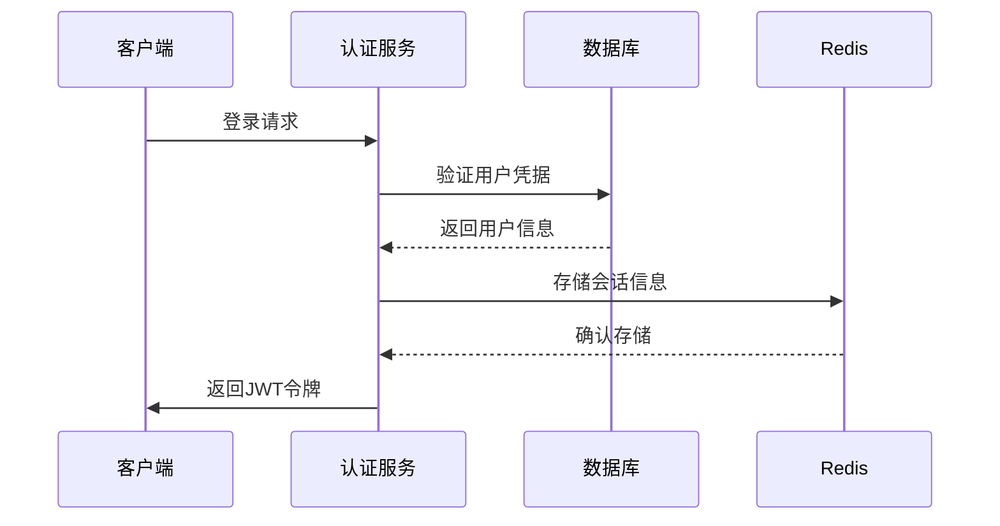
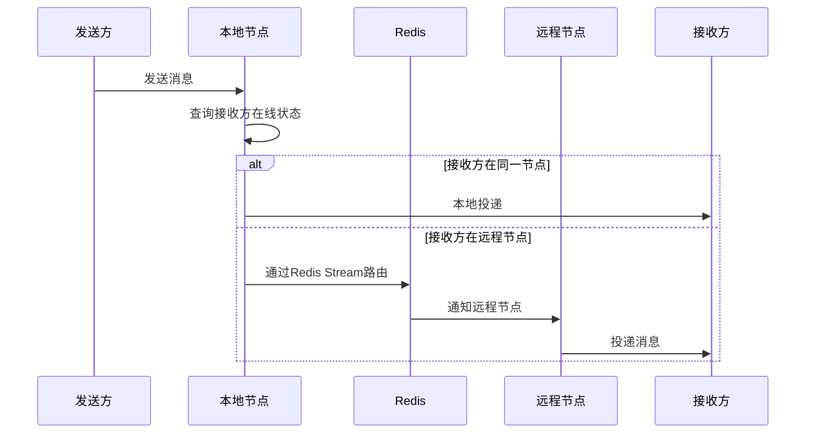
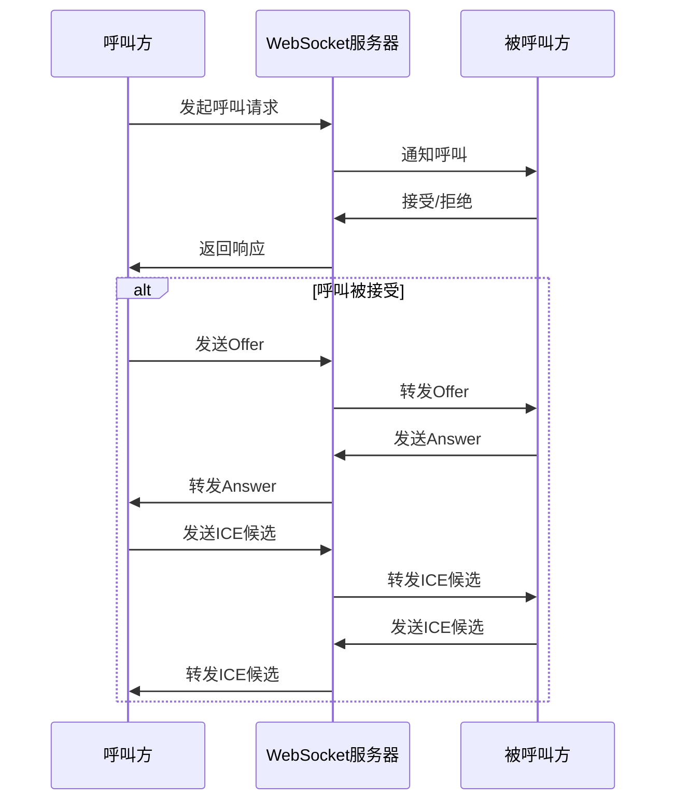

# IM Group Server

IM Group Server 是一个多公司即时通讯系统的核心服务端，支持实时消息传递、音视频通话、AI集成等功能。

## 项目概述

这是一个基于Spring Boot的分布式即时通讯系统服务端，具有以下特性：

- **分布式架构**：支持多节点部署，使用Redis进行状态同步
- **实时通信**：支持TCP长连接和WebSocket通信
- **音视频通话**：集成WebRTC实现实时音视频通话功能
- **AI集成**：支持多种AI服务（OpenAI、Groq等）
- **多租户支持**：基于PostgreSQL Schema的多租户架构
- **LDAP认证**：支持LDAP目录服务认证
- **文件存储**：支持多种文件存储策略

## 技术栈

- **后端框架**：Spring Boot 3.x, Spring Security, Spring Data JPA
- **数据库**：PostgreSQL, Redis
- **消息协议**：Protobuf, TCP, WebSocket
- **认证授权**：JWT, OAuth2, LDAP
- **音视频**：WebRTC
- **AI集成**：Spring AI, OpenAI API
- **前端技术**：Kotlin Multiplatform, Compose Multiplatform

## 目录结构

```
server/
├── src/main/java/com/github/im/server/          # 主源代码
│   ├── ai/                                     # AI相关功能
│   ├── config/                                 # 配置类
│   ├── controller/                             # 控制器
│   ├── handler/                                # 协议处理器
│   ├── service/                                # 业务服务
│   ├── repository/                             # 数据访问层
│   ├── security/                               # 安全相关
│   └── Application.java                        # 应用主类
├── src/main/resources/                         # 资源文件
│   ├── application.yml                         # 主配置文件
│   └── application-ai.yml                      # AI配置文件
├── pom.xml                                     # Maven配置
└── README.md                                   # 本文档
```

## 核心功能

### 0. 分布式架构设计

[查看节点ID配置](src/main/java/com/github/im/server/config/NodeId.java)

系统支持多节点部署，每个节点拥有唯一标识，确保分布式环境下的消息正确路由。

```java
@Component
public class NodeId {
    public static final String NODE_ID = UUID.randomUUID().toString();
}
```

### 1. 实时消息路由

[查看消息路由实现](src/main/java/com/github/im/server/service/MessageRouter.java)

消息路由服务负责在分布式节点间路由消息，实现跨节点用户通信。

```java
@Service
@RequiredArgsConstructor
public class MessageRouter {
    // 实现跨节点消息路由逻辑
}
```

[查看路由消费者实现](src/main/java/com/github/im/server/consumer/RouteConsumer.java)

跨节点消息路由消费者负责消费Redis Stream中的跨节点消息，并将其投递给本节点的用户连接。

```java
@Component
@RequiredArgsConstructor
public class RouteConsumer {
    // 实现跨节点消息路由消费者
    // 负责消费Redis Stream中的跨节点消息
}
```

### 2. 在线状态管理

[查看在线状态管理](src/main/java/com/github/im/server/service/OnlineService.java)

管理用户在线状态，支持分布式环境下的状态同步。

```java
@Service
@RequiredArgsConstructor
public class OnlineService {
    // 实现分布式用户在线状态管理
    // 支持用户上线、下线、心跳续期等功能
}
```

### 3. WebRTC信令服务

[查看WebRTC信令处理器](src/main/java/com/github/im/server/handler/SignalWebSocketHandler.java)

处理WebRTC信令消息，包括offer/answer/candidate等。

```java
@Component
public class SignalWebSocketHandler extends TextWebSocketHandler {
    // 实现WebRTC信令消息处理
    // 支持呼叫、接听、挂断等操作
}
```

### 4. AI聊天机器人

[查看AI机器人配置](src/main/java/com/github/im/server/ai/AiBotConfig.java)

支持多种AI模型的聊天机器人框架。

[查看AI机器人配置](src/main/java/com/github/im/server/ai/AiBotConfig.java)

支持多种AI模型的聊天机器人框架。

## 配置说明

[查看主配置文件](src/main/resources/application.yml)

### 数据库配置

```yaml
spring:
  datasource:
    url: jdbc:postgresql://${DB_IP:localhost}:${DB_PORT:5432}/group
    username: ${DB_USER:postgres}
    password: ${DB_PASSWORD:postgres}
    driver-class-name: org.postgresql.Driver
  jpa:
    hibernate:
      ddl-auto: update
    properties:
      hibernate:
        multiTenancy: SCHEMA
```

### Redis配置

```yaml
spring:
  data:
    redis:
      host: ${REDIS_HOST:localhost}
      port: ${REDIS_PORT:6379}
```

### AI配置

[查看AI配置](src/main/resources/application-ai.yml)

支持多种AI服务提供商的配置：

```yaml
# AI服务配置
app:
  ai:
    provider: groq  # 可选值: groq, openai
# Groq配置 (使用OpenAI兼容接口)
spring:
  ai:
    enabled: false
    groq:
      api-key: ${GROQ_API_KEY:your-groq-api-key-here}  # 从环境变量GROQ_API_KEY读取
      base-url: https://api.groq.com/openai/v1
      default-options:
        model: llama3-70b-8192  # 可选: llama3-70b-8192, llama3-8b-8192, mixtral-8x7b-32768, gemma-7b-it
        temperature: 0.7
        top-p: 0.8
        max-tokens: 1000

# OpenAI配置
    openai:
      api-key: ${OPENAI_API_KEY:your-openai-api-key-here}  # 从环境变量OPENAI_API_KEY读取
      base-url: https://api.openai.com/v1
      default-options:
        model: gpt-3.5-turbo
        temperature: 0.7
        top-p: 0.8
        max-tokens: 1000
```

[查看AI配置类](src/main/java/com/github/im/server/config/ai/MultiAiConfig.java)

AI配置支持多种模型提供商的自动切换，系统会根据配置的API密钥自动选择合适的模型。

### WebRTC配置

```yaml
webrtc:
  session-timeout: 300000
  ice-servers:
    - url: "stun:stun.l.google.com:19302"
  turn-enabled: false
```

## 架构设计

### 分布式节点架构

[查看节点ID配置](src/main/java/com/github/im/server/config/NodeId.java)

系统支持多节点部署，每个节点拥有唯一标识：

```java
@Component
public class NodeId {
    public static final String NODE_ID = UUID.randomUUID().toString();
}
```

### 消息流转架构

[查看消息分发初始化](src/main/java/com/github/im/server/config/MessageDispatchInit.java)

### TCP长连接服务

[查看TCP服务器实现](src/main/java/com/github/im/common/connect/connection/server/tcp/ReactorTcpServer.java)

基于Reactor Netty的TCP服务器实现，支持高并发长连接。

```java
public class ReactorTcpServer implements ReactiveServer {
    // 基于Reactor Netty的TCP服务器实现
    // 支持高并发长连接通信
}
```

## 安全特性

[查看安全配置](src/main/java/com/github/im/server/config/security/SecurityConfig.java)

- JWT令牌认证
- OAuth2资源服务器
- LDAP目录服务集成
- 多租户数据隔离

```java
@Configuration
@EnableWebSecurity
@EnableMethodSecurity
public class SecurityConfig {
    // 实现全面的安全配置
    // 包括JWT、OAuth2、LDAP等认证方式
}
```

## 部署说明

### 快速启动

最简单的方式是使用一键部署脚本：

**Docker Compose (推荐):**
```bash
# Linux/macOS
./deploy/scripts/deploy.sh

# Windows
deploy\\scripts\\deploy.bat
```

**Kubernetes:**
```bash
# Linux/macOS
./deploy/scripts/deploy-k8s.sh

# Windows
./deploy/scripts/deploy-k8s.ps1
```

### 环境要求

- Java 21+
- PostgreSQL 12+
- Redis 6+
- Maven 3.8+

### 构建步骤

```bash
# 编译项目
mvn clean package

# 运行应用
java -jar server/target/server-1.0-SNAPSHOT.jar
```

### 环境变量配置

- `DB_IP`: 数据库主机地址
- `DB_PORT`: 数据库端口
- `DB_USER`: 数据库用户名
- `DB_PASSWORD`: 数据库密码
- `REDIS_HOST`: Redis主机地址
- `REDIS_PORT`: Redis端口
- `OPENAI_API_KEY`: OpenAI API密钥（可选）

## API接口

### REST API

- `/api/users` - 用户管理
- `/api/messages` - 消息管理
- `/api/conversations` - 会话管理
- `/api/webrtc` - WebRTC信令接口
- `/api/ai-bot` - AI机器人接口

### WebSocket端点

- `/ws/signaling` - WebRTC信令通道
- `/ws/chat` - 聊天消息通道

## 性能优化

- 连接池配置优化
- Redis缓存策略
- 异步非阻塞处理
- 消息批量处理

## 监控与运维

- 日志级别配置
- 连接状态监控
- 消息路由追踪
- 性能指标收集

## 扩展性

- SPI扩展机制
- 多存储策略支持
- 插件化AI服务
- 可配置的认证方式

## 时序图

### 用户登录流程



### 消息发送流程



### WebRTC呼叫流程



## 故障排查

常见问题及解决方案：

1. **数据库连接失败**：检查数据库服务是否运行，配置参数是否正确
2. **Redis连接失败**：验证Redis服务状态和网络连接
3. **WebSocket连接失败**：检查防火墙设置和端口开放情况
4. **AI服务不可用**：确认API密钥配置正确

## 贡献指南

1. Fork项目
2. 创建功能分支
3. 提交更改
4. 发起Pull Request

## 许可证

本项目采用 MIT 许可证。